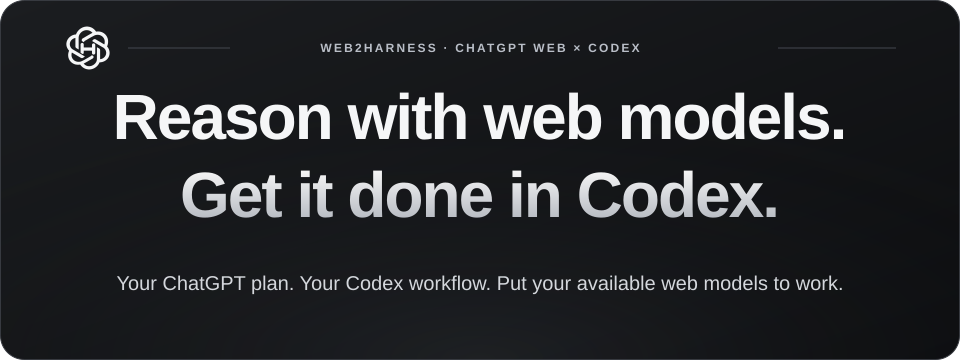
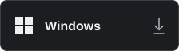
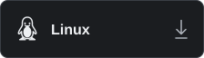
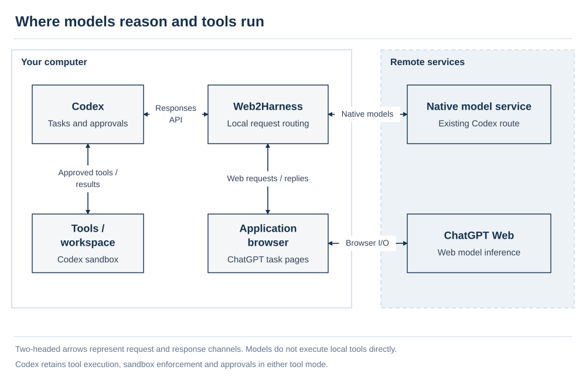

<p align="center">
  
</p>

**Web2Harness** — Bring ChatGPT web models into Codex, keep your native tools and existing workflow, and make the most of the web model usage available on your ChatGPT account to get more real work done.

<p align="center">
  <a href="https://github.com/cmyk-labs/web2harness/releases/download/v1.1.1/web2harness-1.1.1-win-x64.exe"></a>&nbsp;
  <a href="https://github.com/cmyk-labs/web2harness/releases/download/v1.1.1/web2harness-1.1.1-mac-arm64.dmg"></a>&nbsp;
  <a href="https://github.com/cmyk-labs/web2harness/releases/download/v1.1.1/web2harness-1.1.1-linux-x64.AppImage"></a>
</p>

<p align="center">
  <a href="README.md">English</a> · <a href="README.zh-CN.md">简体中文</a>
</p>

<p align="center">
  <a href="#how-it-works">How it works</a> · <a href="#get-started">Get started</a> · <a href="#modes">Tool modes</a> · <a href="#features">Features</a> · <a href="#development">From source</a> · <a href="#faq">FAQ</a>
</p>

<div id="overview"></div>
<a id="features"></a>

## What you can do

Select a **(Web)** model in Codex to use your signed-in ChatGPT account for repository analysis, code changes, command checks, and local file tasks. Work stays in Codex, and tools remain subject to the active task's sandbox and approval rules.

| Feature | What it provides |
| --- | --- |
| Web models and reasoning effort | Adds the Web models available to your account alongside native Codex models, with the efforts each route supports. |
| Tool execution | Native mode preserves Codex Code Mode and namespaced custom tools; Codex executes file reads, code changes, and commands permitted for the active task. |
| Conversation continuity | Eligible routes reuse the task's web conversation across tool round trips and follow-up questions, reducing repeated context transfer. |
| History and context | New configurations use Temporary Chat by default; context budgets and compaction follow model and account capabilities. |
| Images and attachments | Automatic interaction forwards task images and PDF, UTF-8 text, or source files supplied inline by the client as real attachments; optional experiments send large context or selected skills as text attachments. |
| Model switching and subagents | Use native and Web models within a task, with subagent delegation governed by the selected compatibility protocol. |
| Desktop management | Sign in, configure modes, check connections, inspect runtime health, and export safe logs in the application. |

**1.1.1:** Context forwarding preserves original Codex roles, order and tool identities, with bridge output encoding kept separate. It does not silently trim history or rewrite raw exec programs. Browser transport limits and model behavior still differ from native API execution; see [context separation](docs/architecture.md#native-tools).

Available models and efforts depend on the signed-in account and browser checks. See the [configuration and model reference](docs/reference.md); the application does not add account quota or unlock unavailable models.

[Watch the demonstration](#demo) · [Get started](#get-started) · [Browse the manuals](#documentation)

<a id="modes"></a>

## Choose a tool mode

Start with **Native Tools + Automatic interaction**.

| Mode | How tasks run | Required setup |
| --- | --- | --- |
| **Native Tools, default** | Sends web requests automatically and returns validated tool requests to Codex for execution. | ChatGPT sign-in and applied configuration; no MCP connector or tunnel. |
| **MCP Bridge** | Connects requests to the active Codex task through a ChatGPT connector, tunnel, and local MCP service. | Additional tunnel credentials and a matching connector; supports automatic or manual interaction. |
| **Browser-only, available through CLI** | Returns web model answers without local tool execution. | CLI configuration and an available browser session. |

**Automatic and Manual describe browser interaction.** Automatic sends prompts through the application; Manual asks the operator to paste and send them in ChatGPT and requires MCP Bridge. Follow the [user guide](docs/user-guide.md) for configuration.

<a id="demo"></a>

## Demonstration and task examples

The recording shows selecting a Web model and reasoning effort in Codex, then using native tools to inspect a project.

<p align="center">
  
</p>

After connecting, try this in Codex:

> List this project's top-level files and explain its main entry points and startup flow. Do not change files yet.

For a task that changes files, state the goal and acceptance criteria:

> Inspect this project's startup flow and fix one reproducible issue. Run the relevant tests, then explain the changes, test results, and anything that remains unverified.

A task typically follows **select a Web model → submit a task → receive a web answer or tool request → approve and execute in Codex → return results and continue reasoning**. It may require several tool round trips. Assess completion through actual file changes, command output, and test results.

<div id="get-started"><a id="quick-start"></a></div>
<a id="installation"></a>

## Get started

Have Codex available on your computer and a ChatGPT account you can sign in to. The header buttons download Windows x64, macOS Apple silicon and Linux x64 installers. Other processors: [macOS Intel](https://github.com/cmyk-labs/web2harness/releases/download/v1.1.1/web2harness-1.1.1-mac-x64.dmg) · [Linux arm64](https://github.com/cmyk-labs/web2harness/releases/download/v1.1.1/web2harness-1.1.1-linux-arm64.AppImage). Choose one matching installer; the [1.1.1 release](https://github.com/cmyk-labs/web2harness/releases/tag/v1.1.1) provides checksums and validation notes. This stable release is available through the application's update check. See the [user guide](docs/user-guide.md) for installation methods and platform requirements, or [run an existing checkout from source](#development).

1. **Start Web2Harness.** Use a package matching your platform and architecture, or run from source.
2. **Sign in through the browser.** Open **Connection & Models**, sign in to ChatGPT in the application browser, and run **Check connection**.
3. **Apply configuration.** Select **Native Tools** and **Automatic**, then choose **Apply configuration**.
4. **Choose a Web model.** Refresh the Codex model catalog or restart the affected client as prompted. Select a model marked **(Web)** and one of its supported reasoning efforts.
5. **Run a task.** Start with the read-only example above and confirm that the answer and tool results return to Codex. Keep Web2Harness running while the integration is in use.

A successful setup preserves native Codex models and adds available Web models. If a step fails, use [troubleshooting](docs/troubleshooting.md) to identify the failing layer.

<a id="how-it-works"></a>

## How it works



Web2Harness manages browser sessions and translates between Codex requests and web model responses. The default Native Tools mode returns validated tool requests to Codex, and tool results become input to subsequent reasoning. MCP Bridge transports tool requests through a connector and tunnel.

See [architecture](docs/architecture.md) for component responsibilities, request sequences, conversation reuse, and data boundaries.

<a id="development"></a>

## Run from source

The source repository is [cmyk-labs/web2harness](https://github.com/cmyk-labs/web2harness). Source development requires Bun 1.4.0. Node.js 22.12.0 or later is also required. From the root of an existing checkout:

```bash
bun install --frozen-lockfile
bun install --cwd launcher --frozen-lockfile
bun run app
```

For code changes or fix validation, launch the independent DEV profile:

```bash
bun run dev:launcher
```

See the [development guide](docs/development.md) for environment setup, independent sign-in, and isolated acceptance. Packaging and installer acceptance are covered in the [release manual](docs/release.md).

<a id="faq"></a>

## FAQ

- **Can I still use native Codex models?** Yes; Web models are additional entries. Native requests also pass through the local service while it manages the route. Before discontinuing the application, remove its integration as described in the [user guide](docs/user-guide.md).
- **Does saving history guarantee reuse of the same web chat?** These settings are independent. History controls whether ChatGPT retains the chat; reuse also depends on the mode, task ownership, and context continuity.
- **Why do my models and effort choices differ from someone else's?** The catalog follows account capabilities. Instant and Thinking may have separate entries when their context budgets differ. Exact mappings are in the [configuration and model reference](docs/reference.md).

<a id="release-history"></a>

## Version history

User-visible features, fixes, and compatibility changes are recorded by version, newest first.

| Version | Date | Changes |
| --- | --- | --- |
| 1.2.0 | Unreleased | Adds GPT-6 and GPT-5.6 Sol family/effort selection, model-level local usage and recoverable send receipts. New configurations default to Temporary Chat. Stabilizes browser viewports, repeated paragraphs and formula extraction; updates security dependencies. |
| 1.1.1 | 2026-10-05 | Preserve original Codex context and tool declarations, namespaces, call scopes, and raw exec input. Separate bridge transport instructions; verify retained-history prefixes and reject unsupported content without silent trimming. Refresh MCP tool definitions after upgrading. Fix automatic tab switches interrupting model selection during parallel tasks, and add three mandatory live release acceptance cases. |
| 1.1.0 | 2026-10-05 | Preserve native Code Mode and namespaced custom tools, input formats and call identities. Transfer inline PDF/text/source files through real attachments and preserve image fidelity hints. Add manual and periodic update checks, check timestamps, download progress, responsive checksum verification and readable log summaries. |
| 1.0.2 | 2026-10-05 | Adds a blue sidebar update notice with download/install states. Windows updates show a separate installer progress window and reopen the app after completion; setup keeps shortcut icons outside the replaced application directory and records stage durations. Fixes the plan-reference dropdown's dark colors and defaults its reference table to Pro $200. The update from an older updater such as 1.0.1 still uses its original silent flow; the new window applies to subsequent updates. |
| 1.0.1 | 2026-10-05 | Saved chats use creation time, a stable task name, and separate dialogue/compaction sequence numbers. Retained saved conversations are checked by conversation ID before incremental submission; tool round trips refresh the owned browser viewport to preserve reuse. Local usage recording is automatic, with per-model rolling counts and published policy references clearly separated from unconfirmed official periods. Health checks show readable names and distinct statuses; Native Tools diagnostics and persistent missing-record warnings are corrected. |
| 1.0.0 | 2026-10-04 | Initial Web2Harness version. Adds account-aware Web models and reasoning efforts to Codex, defaults to native tools, and supports conversation reuse, saved chat history, and context management. Includes MCP Bridge and Browser-only modes, an English and Simplified Chinese desktop workspace, connection settings, runtime controls, and diagnostics. Provides native packaging for Windows, macOS, and Linux, with runtime preparation during Windows setup and lightweight warm-start checks. |

<a id="documentation"></a>

## Documentation

Start with the user guide. Go directly to troubleshooting for a failure, and consult the other manuals as needed.

| What you need | Manual |
| --- | --- |
| Installation, connection, mode setup, daily use, upgrades, and removal | [User guide](docs/user-guide.md) |
| Startup, model catalog, task execution, or installation failures | [Troubleshooting](docs/troubleshooting.md) |
| Setting defaults, model efforts, context budgets, commands, and storage | [Configuration and model reference](docs/reference.md) |
| Components, request flow, conversation lifecycle, and permission boundaries | [Architecture](docs/architecture.md) |
| Source development, contributions and review, isolated tests, naming, and documentation maintenance | [Development manual](docs/development.md) |
| Builds, packages, acceptance, publication, rollback, and security maintenance | [Release manual](docs/release.md) |
| Mandatory live capability cases for each release, evidence, and case extensions | [Acceptance tests](docs/acceptance-tests.md) |

See [Contributing and review](docs/development.md#contributing) for submissions, [Report a vulnerability](docs/release.md#vulnerability-reporting) for private reports, and the [repository instructions](AGENTS.md) for automated work.


<a id="project-notes"></a>

## Project notes

Web2Harness is an independent open-source research project for technical research, learning, and experimentation. It is not recommended for production use and is not affiliated with, authorized, sponsored, or endorsed by OpenAI. Its browser integration depends on ChatGPT interface and service behavior. Use accounts that you own or are authorized to use, subject to applicable service terms and workspace policies.

The project continues development from [miuuyy/codex-chatgpt-web](https://github.com/miuuyy/codex-chatgpt-web) at commit `7579422`, the 6.0.0 code baseline dated September 23, 2026. Web2Harness maintains its own application identity, documentation, and release lifecycle.

The project is distributed under the [MIT License](LICENSE). The original copyright notice and MIT license are preserved in [LICENSES/codex-chatgpt-web-MIT.txt](LICENSES/codex-chatgpt-web-MIT.txt). The root license identifies subsequent Web2Harness contributions. The research positioning does not change the permissions in the license.
