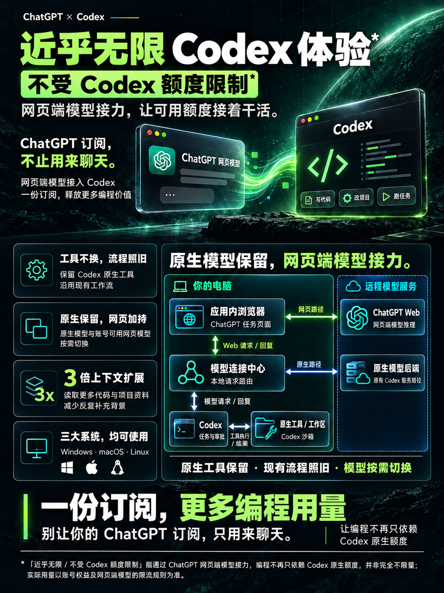
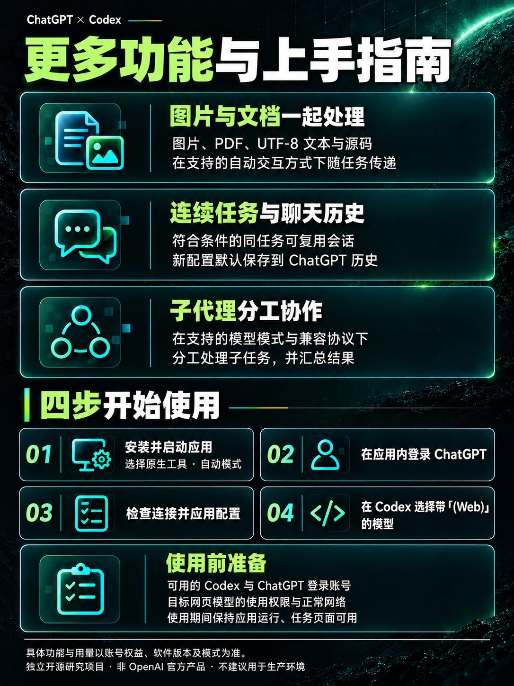
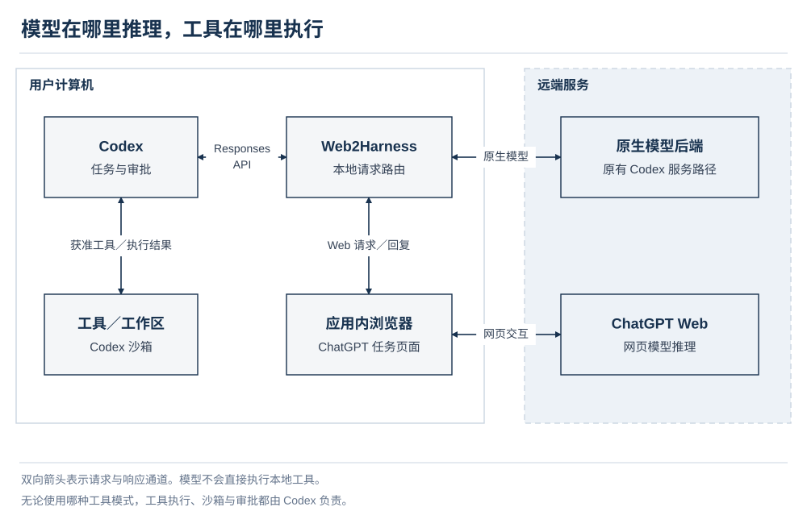

<p align="center">
  
</p>

**Web2Harness** — 将 ChatGPT 网页版模型接入 Codex，沿用原生工具与现有工作流，同时充分利用你 ChatGPT 账户中可用的 Web 模型额度，完成更多实际任务。

<p align="center">
  <a href="https://github.com/cmyk-labs/web2harness/releases/download/v1.2.0/web2harness-1.2.0-win-x64.exe"></a>&nbsp;
  <a href="https://github.com/cmyk-labs/web2harness/releases/download/v1.2.0/web2harness-1.2.0-mac-arm64.dmg"></a>&nbsp;
  <a href="https://github.com/cmyk-labs/web2harness/releases/download/v1.2.0/web2harness-1.2.0-linux-x64.AppImage"></a>
</p>

<p align="center">
  <a href="README.md">English</a> · <a href="README.zh-CN.md">简体中文</a>
</p>

<p align="center">
  <a href="#how-it-works">工作原理</a> · <a href="#get-started">快速开始</a> · <a href="#modes">工具模式</a> · <a href="#features">功能与偏好</a> · <a href="#development">源码运行</a> · <a href="#faq">常见问题</a>
</p>

<div id="overview"></div>
<a id="features"></a>

## 能做什么

在 Codex 中选择 **(Web)** 模型，即可使用已登录 ChatGPT 账号的网页模型完成仓库分析、代码修改、命令检查和本地文件处理。任务仍在 Codex 中进行，工具继续遵守当前任务的沙箱与审批规则。

| 功能 | 使用效果 |
| --- | --- |
| Web 模型与思考强度 | 在原有 Codex 模型之外增加账号可用的 Web 模型，并提供各模型支持的强度选项。 |
| 工具执行 | 原生模式保留 Codex Code Mode 与带命名空间的自定义工具，由 Codex 执行当前任务允许的文件读取、代码修改和命令。 |
| 连续对话 | 同一任务的工具往返和后续追问可复用符合条件的网页会话，减少重复发送上下文。 |
| 聊天历史与上下文 | 新配置默认临时聊天；按模型和账号能力管理上下文预算与压缩。 |
| 图片与附件 | 自动交互传递任务图片，并将客户端内联提供的 PDF、UTF-8 文本或源码作为真实附件发送；可选实验功能将较大上下文或所选技能作为文本附件发送。 |
| 模型切换与子代理 | 在任务中切换原生与 Web 模型，并按所选兼容协议委派子代理任务。 |
| 桌面管理 | 在应用内完成登录、模式配置、连接检查、运行诊断和安全日志导出。 |

**1.2.0：**适配 GPT-6 与 GPT-5.6 Sol 系列及其可用思考档位，按模型汇总本地使用次数，新配置默认临时聊天。继续保留 Codex 原始上下文与工具身份，详见[上下文分离说明](docs/architecture.zh-CN.md#native-tools)。

可用模型与档位取决于登录账号和浏览器检查结果。详见[配置与模型参考](docs/reference.zh-CN.md)；应用不会增加账号额度或解锁未开放的模型。

[观看演示](#demo) · [快速开始](#get-started) · [查阅手册](#documentation)

<a id="product-overview"></a>

## 产品介绍

<p align="center">
  <a href="assets/posters/web2harness-overview.zh-CN.png"></a>
  <a href="assets/posters/web2harness-features.zh-CN.png"></a>
</p>

<a id="modes"></a>

## 选择工具模式

首次使用建议选择**原生工具 + 自动交互**。

| 模式 | 如何执行任务 | 配置要求 |
| --- | --- | --- |
| **原生工具，默认** | 自动发送网页请求，将校验后的工具请求交给 Codex 执行。 | 登录 ChatGPT 并应用配置；无需 MCP 连接器或隧道。 |
| **MCP Bridge** | 通过 ChatGPT 连接器、隧道和本地 MCP 服务，把请求交给活动 Codex 任务。 | 另需隧道凭据和匹配的连接器；支持自动或手动交互。 |
| **仅浏览器，CLI 提供** | 返回网页模型回答，不执行本地工具。 | 通过 CLI 配置，并保持浏览器会话可用。 |

**自动／手动是网页交互方式**。自动由应用发送提示词；手动由操作者在 ChatGPT 中粘贴并发送，仅适用于 MCP Bridge。配置步骤见[使用手册](docs/user-guide.zh-CN.md)。

<a id="demo"></a>

## 演示与任务示例

演示展示在 Codex 中选择 Web 模型与思考强度，并通过原生工具分析项目的过程。

<p align="center">
  
</p>

首次连接后，可以在 Codex 中尝试：

> 列出这个项目的顶层文件，解释主要入口和启动流程，先不要修改文件。

需要实际修改时，可以明确任务和验收条件：

> 检查这个项目的启动流程，修复一个能够复现的问题。运行相关测试，并说明修改内容、测试结果和仍未验证的部分。

一次任务通常会经历：**选择 Web 模型 → 提交任务 → 网页模型回答或请求工具 → Codex 审批并执行 → 返回结果并继续推理**。工具可能调用多轮，完成情况应以实际文件变化、命令输出和测试结果判断。

<div id="get-started"><a id="quick-start"></a></div>
<a id="installation"></a>

## 快速开始

准备本机可用的 Codex，以及能够登录的 ChatGPT 账号。顶部按钮分别下载 Windows x64、macOS Apple silicon 和 Linux x64 安装包。其他处理器：[macOS Intel](https://github.com/cmyk-labs/web2harness/releases/download/v1.2.0/web2harness-1.2.0-mac-x64.dmg) · [Linux arm64](https://github.com/cmyk-labs/web2harness/releases/download/v1.2.0/web2harness-1.2.0-linux-arm64.AppImage)。选择一个匹配的安装包即可，校验和与验收说明见 [1.2.0 发布页面](https://github.com/cmyk-labs/web2harness/releases/tag/v1.2.0)。当前为正式版，已安装应用可通过检查更新获取。安装方式与平台要求见[使用手册](docs/user-guide.zh-CN.md)，已有源码目录也可按下方[源码运行](#development)启动。

1. **启动 Web2Harness**。使用与你的平台、架构匹配的安装包，或从源码启动。
2. **完成浏览器登录**。打开「连接与模型」，在应用浏览器中登录 ChatGPT，运行「检查连接」。
3. **应用配置**。选择「原生工具」和「自动」，然后选择「应用配置」。
4. **选择 Web 模型**。按提示刷新 Codex 模型目录或重启受影响的客户端，选择带 **(Web)** 标记的模型及其支持的思考强度。
5. **开始任务**。先尝试上面的只读示例，确认回答及工具结果能返回 Codex。使用集成期间保持 Web2Harness 运行。

集成成功后，Codex 保留原生模型并增加可用 Web 模型。出现问题时，按[故障排查](docs/troubleshooting.zh-CN.md)检查失败环节。

<a id="how-it-works"></a>

## 工作原理



Web2Harness 管理浏览器会话，并在 Codex 请求与网页模型响应之间转换格式。默认的原生工具模式将经过校验的工具请求返回 Codex，工具结果进入后续推理。MCP Bridge 使用连接器与隧道传递工具请求。

组件职责、调用时序、会话复用和数据边界见[架构设计](docs/architecture.zh-CN.md)。

<a id="development"></a>

## 从源码运行

项目源码位于 [cmyk-labs/web2harness](https://github.com/cmyk-labs/web2harness)。源码运行需要 Bun 1.4.0，以及 Node.js 22.12.0 或更高版本。在已有源码目录的根目录执行：

```bash
bun install --frozen-lockfile
bun install --cwd launcher --frozen-lockfile
bun run app
```

修改代码或验证修复时，使用独立 DEV 配置启动：

```bash
bun run dev:launcher
```

开发环境准备、独立登录和隔离验收见[开发指南](docs/development.zh-CN.md)。打包及安装验收见[发布手册](docs/release.zh-CN.md)。

<a id="faq"></a>

## 常见问题

- **原有 Codex 模型还能用吗**？可以，Web 模型是新增入口。应用管理路由期间，原生请求也经过本地服务；需要停用应用时，先按[使用手册](docs/user-guide.zh-CN.md)移除集成。
- **保存到历史就一定复用同一个网页聊天吗**？两者独立。保存历史决定 ChatGPT 是否保留记录；会话复用还取决于模式、任务归属和上下文连续性。
- **为什么模型与强度选项和别人不同**？目录根据账号能力生成；上下文预算不同的 Instant 和 Thinking 可能分开显示。准确映射见[配置与模型参考](docs/reference.zh-CN.md)。

<a id="release-history"></a>

## 版本更新记录

按版本记录用户可见的功能、修复与兼容性变化，最新版本在前。

| 版本 | 日期 | 更新内容 |
| --- | --- | --- |
| 1.2.0 | 2026-10-09 | 适配 GPT-6、GPT-5.6 Sol 系列与思考档位，增加按模型汇总的本地用量及可恢复发送回执；新配置默认临时聊天。修复浏览器视口、重复段落及公式提取，更新安全依赖。 |
| 1.1.1 | 2026-10-05 | 保留 Codex 原始上下文、工具声明、命名空间、调用范围及 exec 原文，桥接传输协议独立组织；续聊校验历史前缀，不支持的内容明确报错、不静默裁剪。升级后需刷新 MCP 工具定义。修复并行任务自动切页打断模型选择的问题，新增三项每次发布必测的真实能力验收用例。 |
| 1.1.0 | 2026-10-05 | 保留原生 Code Mode、带命名空间的自定义工具、输入格式与调用身份。内联 PDF／文本／源码通过真实附件传输，保留图片清晰度参数。新增手动及定时检查更新、检查时间、下载进度、异步校验与可读日志说明。 |
| 1.0.2 | 2026-10-05 | 新增侧栏蓝色更新提醒，同步显示下载／安装状态。Windows 更新使用独立安装进度窗口，完成后重新打开应用；快捷方式图标保存到应用替换目录之外，并记录安装阶段耗时。修复套餐参考下拉列表深色配色，默认参考 Pro $200。由 1.0.1 等旧更新程序升级的那一次仍沿用原静默流程，新进度窗口用于后续更新。 |
| 1.0.1 | 2026-10-05 | 保存的聊天统一使用创建时间、固定任务名和对话／压缩独立编号；增量续聊发送前核验保存会话的对话 ID，工具往返时重新建立自有页面的可用尺寸，保持会话复用。默认记录本地用量，按模型展示滚动统计与官方公开上限参考，明确标注官方周期未确认；健康检查使用易懂名称与明确状态，修正原生工具诊断提示并持久保留漏记告警。 |
| 1.0.0 | 2026-10-04 | Web2Harness 初始版本。按账号能力向 Codex 提供 Web 模型与思考强度，默认使用原生工具，支持会话复用、聊天历史保存及上下文管理。提供 MCP Bridge、仅浏览器模式，以及支持中英文的桌面工作区、连接设置、运行控制和诊断功能。支持 Windows、macOS、Linux 原生打包，Windows 在安装阶段准备运行环境，重复启动执行轻量检查。 |

<a id="documentation"></a>

## 文档导航

初次使用从使用手册开始；遇到异常直接查故障排查，其余手册按需阅读。

| 需要了解什么 | 手册 |
| --- | --- |
| 安装、连接、模式配置、日常操作、升级与卸载 | [使用手册](docs/user-guide.zh-CN.md) |
| 启动、模型目录、任务执行或安装异常 | [故障排查](docs/troubleshooting.zh-CN.md) |
| 设置默认值、模型强度、上下文预算、命令与数据位置 | [配置与模型参考](docs/reference.zh-CN.md) |
| 系统组件、请求流程、会话生命周期及权限边界 | [架构设计](docs/architecture.zh-CN.md) |
| 源码开发、贡献评审、隔离测试、命名与文档维护 | [开发手册](docs/development.zh-CN.md) |
| 构建、打包、验收、发布、回滚与安全维护 | [发布手册](docs/release.zh-CN.md) |
| 每次发布必测的真实能力用例、证据与扩展方式 | [能力验收用例](docs/acceptance-tests.zh-CN.md) |

提交变更见[参与贡献与评审](docs/development.zh-CN.md#contributing)；私密报告见[报告漏洞](docs/release.zh-CN.md#vulnerability-reporting)；自动化代理遵守[仓库协作规则](AGENTS.zh-CN.md)。


<a id="project-notes"></a>

## 项目说明

Web2Harness 是独立开源研究项目，用于技术研究、学习和实验，不建议用于生产环境。本项目与 OpenAI 无关联，也未获得 OpenAI 的授权、赞助或背书。浏览器集成依赖 ChatGPT 界面和服务行为。请使用本人拥有或获授权的账户，并遵守适用的服务条款和工作区政策。

本项目基于 [miuuyy/codex-chatgpt-web](https://github.com/miuuyy/codex-chatgpt-web) 的提交 `7579422` 继续开发，该提交为 2026 年 9 月 23 日的 6.0.0 代码基线。Web2Harness 独立维护应用身份、文档和发布生命周期。

本项目采用 [MIT 许可证](LICENSE)。原始版权声明与 MIT 许可全文保存在 [LICENSES/codex-chatgpt-web-MIT.txt](LICENSES/codex-chatgpt-web-MIT.txt)，根目录许可证标识 Web2Harness 的后续贡献。研究用途的项目定位不改变许可证授予的权限。
