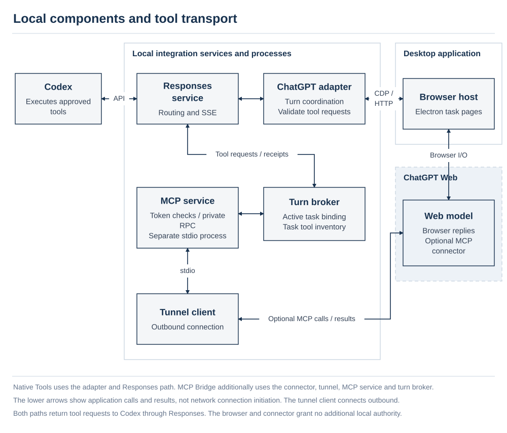
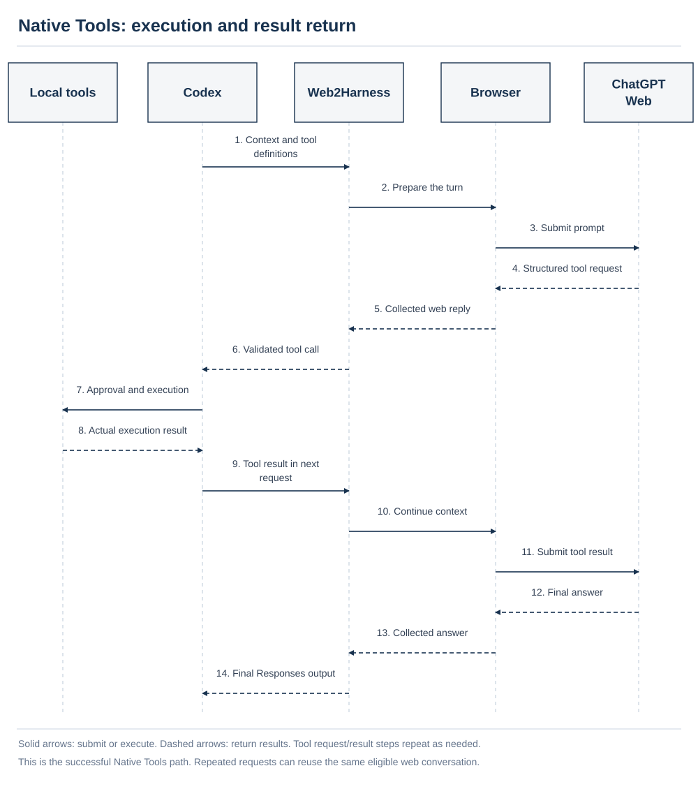
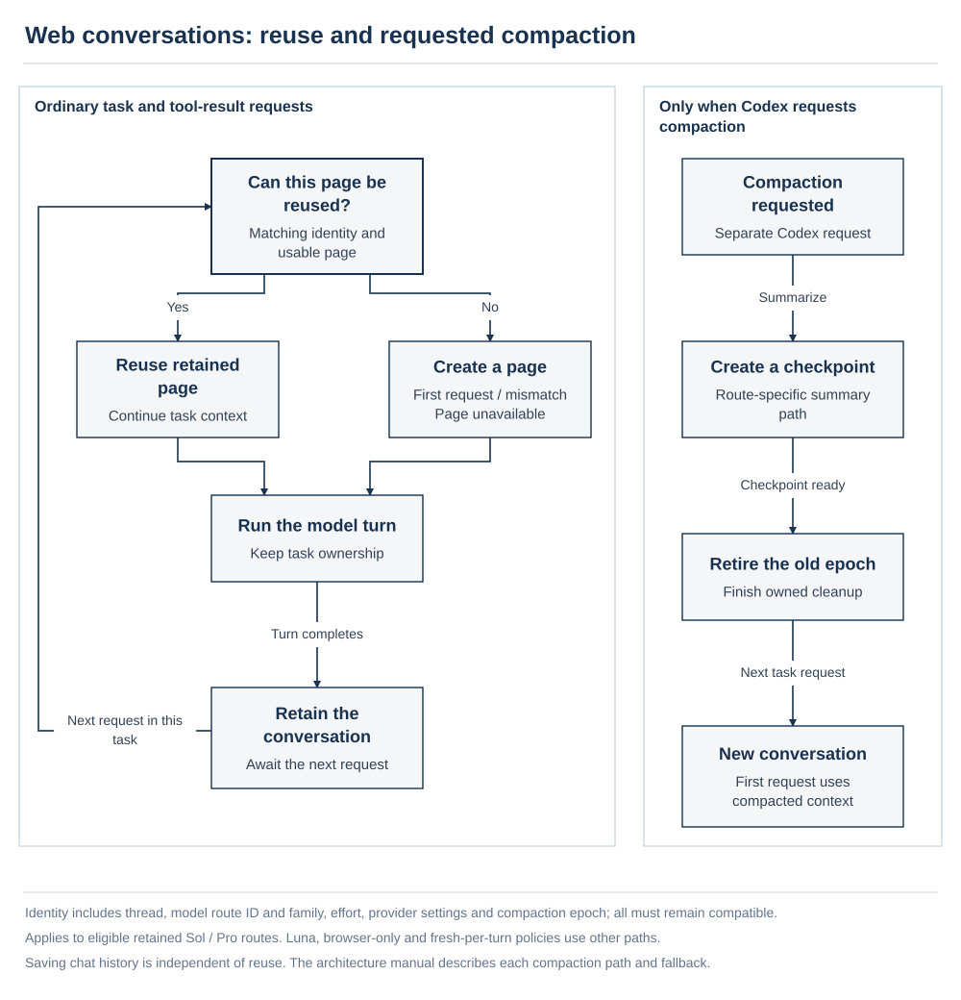
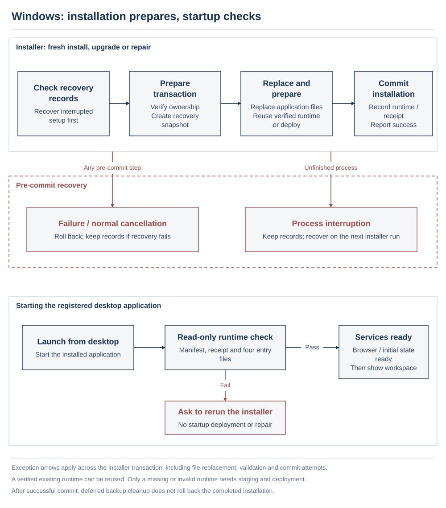
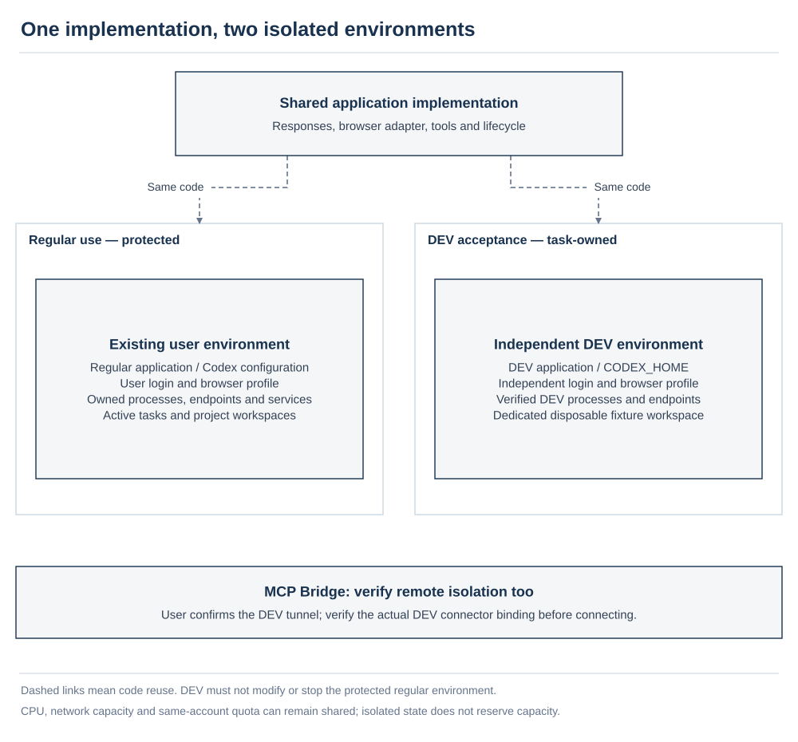

# Architecture and design

[English](architecture.md) | [简体中文](architecture.zh-CN.md) · [Project documentation](../README.md#documentation)

Web2Harness connects Codex's task and tool environment to a signed-in ChatGPT browser session. Codex owns tasks, tool execution, sandbox enforcement, approvals, and workspace changes. Web2Harness owns model routing, browser interaction, protocol translation, and their lifecycle.

This manual follows the system components and execution flow, defining security constraints at the point where they apply. The bridge validates routes, tool inventories, and task ownership; it does not grant additional execution authority or make untrusted model output safe by itself. For operation, use the [user guide](user-guide.md); for fields and budgets, use the [configuration and model reference](reference.md).

**Contents**

- [System context](#system-context)
- [Components and responsibilities](#components)
- [Execution and interaction modes](#execution-modes)
- [Request and tool lifecycle](#request-lifecycle)
- [Conversation state and compaction](#conversation-state-and-compaction)
- [Installation, startup, and shutdown](#installation-and-lifecycle)
- [Security boundaries and data protection](#security-boundaries)
- [Model registry and protocol extension](#model-registry)
- [Failure contracts](#failure-contracts)
- [Development isolation](#development-isolation)

## System context

*The left boundary contains every local component, including the workspace. Web and native model inference use separate remote paths; Codex retains local tool execution.*

Setup preserves Codex's built-in `openai` provider and directs its Responses traffic to the loopback daemon. The daemon forwards official native model requests to their original backend and adds routes in the `chatgpt-web/` namespace for the browser adapter. The authenticated official catalog remains the source for native models; Web2Harness augments it rather than installing an unrelated static catalog.

A ChatGPT Web route and a native/API model are different execution routes. Similar names do not establish identical capabilities, reasoning options, context capacities, availability, or behavior. Web routes are bound to observed browser families and account capabilities. The adapter does not silently replace a requested Web family, effort, or model version with another one.

The local bridge supports Codex's HTTP Responses and SSE transport. A Responses WebSocket prewarm receives HTTP `426`, allowing Codex to negotiate HTTP/SSE without changing the provider or model. Authenticated native Search and Image Gen requests have forwarding paths. Voice session creation retains its official endpoint through a separately managed configuration assignment; it is not sent to the Responses-only bridge.

## Components and responsibilities

*The upper path shows browser turn coordination. The lower path adds MCP Bridge transport; its tool requests return through the Responses service to Codex for execution.*

| Component | Responsibility | Primary implementation |
| --- | --- | --- |
| Desktop launcher | Onboarding, settings, login, diagnostics, startup gate, and process supervision | `launcher/electron/` and `launcher/src/` |
| Runtime supervisor | Start the optional tunnel and daemon, verify readiness, track owned processes, drain and stop safely | `launcher/electron/runtime/runtime-supervisor.cjs` |
| Responses server | Route models and requests, serve health and authenticated lifecycle controls, count active work | `src/server.ts`, `src/codex/native-passthrough.ts` |
| Protocol bridge | Translate parsed requests and adapter events into native Responses items, SSE, usage, and terminal errors | `src/responses/` |
| Model catalog and registry | Define Web route identity, account gates, supported efforts, context budgets, and catalog augmentation | `src/models/` |
| ChatGPT adapter | Coordinate logical turns, retries, context preparation, tool transport, and compaction | `src/adapters/chatgpt-web/adapter.ts` |
| Browser host and helper | Own Electron views, lease exact surfaces, select and verify UI state, submit and observe turns | `launcher/electron/browser/`, `src/browser/`, and the adapter's `browser/` directory |
| Turn broker and MCP server | Bind connector actions to one active Codex turn and its advertised tools | The adapter's `tools/` directory |
| Codex integration | Apply and restore managed assignments, maintain the integration journal, hooks, and model cache | `src/codex/` |
| Installation helpers | Verify runtime manifests, publish versioned runtimes, and manage Windows install/uninstall transactions | `launcher/electron/installation/`, `src/platform/windows/` |
| Configuration migration | Translate supported persisted schemas into the current configuration contract without runtime-specific side effects | `launcher/shared/config-migration.cjs` |

Within `src/responses/`, `stream.ts` produces SSE events, `json.ts` builds non-streaming responses, and `encoding.ts` holds encoding rules used by both paths. Request parsing and state remain in the same protocol directory so transport differences do not duplicate the response contract.

Within `src/adapters/chatgpt-web/`, `browser/` handles page control and model selection, `conversation/` owns conversation identity and compaction continuity, `prompt/` prepares task context and attachments, and `tools/` owns tool transport and active-turn binding. `adapter.ts` coordinates those modules. These are code responsibilities within the shared adapter, not independent services or alternative DEV implementations.

The browser worker coordinates the turn lifecycle through four focused modules: `response-dom.ts` reads response structure and visible traces, `turn-observation.ts` tracks submission/completion evidence and observation time budgets, `browser-diagnostics.ts` captures bounded, redacted diagnostics, and `composer.ts` handles composer text and attachment preparation. These modules preserve the same selected page and active-turn ownership.

Electron's `runtime/` directory supervises the daemon, while `src/runtime/` implements service and tunnel operations used by the core. Desktop `runtime/setup-checkpoint.cjs` captures, compares, and restores the configuration files affected by setup; the supervisor owns the surrounding transaction and process lifecycle. `launcher/shared/` has no Electron dependency: the desktop package includes it, and the Bun runtime bundles the same pure migration implementation. Schema validation and persistence remain with the respective configuration controllers.

The packaged desktop includes Electron, a platform-matched Bun runtime, the bridge, browser helper, and required runtime resources. The normal desktop path uses its embedded browser and does not require a system Node, Bun, or Chrome installation. Optional macOS passkey login requires installed Chrome for a dedicated temporary login profile, then imports validated session state into Electron and cleans the temporary state; model turns remain in Electron. See [security](#local-and-network-surfaces) for this transfer boundary. MCP Bridge additionally requires the pinned official tunnel client, verified against its release checksum manifest.

Daemon and MCP commands reference the durable versioned runtime under the application home. Temporary package mount locations, such as an AppImage mount, must not become persisted integration commands. The advanced terminal path and its platform requirements are documented in [installation](user-guide.md).

## Execution and interaction modes

Runtime mode determines how a Web model reaches Codex tools. Browser interaction mode determines who operates the ChatGPT page. These are distinct settings.

| Runtime mode | Tool request path | Tool execution | Tunnel and MCP |
| --- | --- | --- | --- |
| Native Tools (default) | Structured browser reply → validated Responses tool call | Codex, under its existing sandbox and approval policy | Not started or attached |
| MCP Bridge | ChatGPT connector → tunnel → MCP server → active-turn broker → Codex tool call | Codex, under its existing sandbox and approval policy | Required |
| Browser-only | Browser answer only; Codex receives a notice that local tools are unavailable | No local tool requests from this Web route | Not started or attached |

### Context and transport separation

A browser submission contains one sentence defining the bridge role, the original structured request in `codex_context_json` (or its complete context-file equivalent), then a separate `codex_bridge_protocol`. The source snapshot preserves instructions, roles, item/block order, tool namespace trees, custom formats, request controls, call/result IDs, error fields and other input metadata. Runtime indexes are separate and are not replayed as substitute source context. Transport credentials and local routing metadata stay outside the source.

Binary image/file data is carried as validated attachments at its original position; bridge-owned reasoning and compaction envelopes have a reversible decoded view. Unknown content or unreadable provider-encrypted content fails explicitly. The bridge does not delete old model-switch instructions, rewrite handle-like strings, drop old images, trim compaction history or summarize on its own. Only native Codex compaction replaces canonical history. An upload that exceeds the browser limit is rejected; the explicitly enabled Context as File feature can carry complete supported input.

A verified retained prefix is labelled `transport_context.mode=append`, with its length and hash; fresh requests use `complete`. These labels describe transport, not new Codex roles. Encoding several original roles into one browser message cannot reproduce native API role enforcement or guarantee identical model behavior. Execution, sandbox and approvals remain with Codex.

The MCP tool-call schema now separates `name`, `namespace` and `scope`. Refresh the selected connector's cached tool definitions before using this schema; an old ordinary `wire_name` call fails with a refresh instruction. The existing reserved compaction control still uses `wire_name`. No connector is silently substituted.

### Native Tools

The adapter includes the current tool definitions in the compiled context. When the browser response completes, it parses structured tool requests against the tools declared by that Codex request. Valid requests become native function or freeform tool-call items. Codex executes them and sends their results in the next model request. A final browser answer becomes the Codex response.

Malformed tool blocks produce an explicit adapter failure. A bounded corrective retry can rebuild from canonical Codex history; invalid browser decisions are not adopted as successful tool execution. The adapter cannot add tools or grant permissions through the prompt.

In Native Tools mode, the model catalog preserves Codex's original Code Mode setting. The request parser retains custom-tool format and namespace, and JSON/SSE output restores the same call identity. Top-level identity is the original name plus namespace and kind; internal routing keys never become model-facing aliases. Conflicting declarations for the same identity fail before dispatch. `exec` and `wait` execute in the outer Codex process; the browser prompt distinguishes them from ChatGPT's own tools. Inline file data follows the same validated attachment path as images, with content-derived filenames and explicit helper capability negotiation. It does not resolve local paths or remote provider file IDs.

### MCP Bridge

The browser prompt carries an opaque capability for one outer Codex turn. Every connector action presents that capability. The local broker derives an internal binding, checks the current tool inventory, and relays the request to Codex. Results return through the MCP call so multiple tool rounds can remain within the same ChatGPT response.

The connector supports exact-name discovery and invocation for tools exposed through Codex's code-mode gateway. It also relays the gateway's freeform input unchanged. Top-level calls carry the original name and namespace; nested calls explicitly select the exec scope and must appear in the runtime's ALL_TOOLS exports. Top-level availability does not imply nested availability. These mechanisms expose the active outer tool environment; they do not create a second executor or planner. All available Web efforts use the same capability contract.

The connector identity is part of the public MCP schema contract. Automatic and manual interaction have distinct connector identities and tunnel configurations. An incompatible cached connector must not be reused by silently renaming or selecting a different identity. Current names and setup requirements are in the [configuration reference](reference.md#runtime-settings).

### Automatic and Zero Risk interaction

Automatic interaction selects the requested browser model and effort, verifies them before Send, submits the prompt and attachments, and observes the response. It supports all three runtime modes.

Zero Risk is manual interaction, available only with MCP Bridge. The launcher opens the owned surface and copies the compiled prompt to the clipboard. The user pastes it, selects the model, effort, and connector, sends it, and confirms Sent. The launcher does not inspect or manipulate the ChatGPT DOM during manual interaction. Start and completion are reported through the manual MCP contract, using an opaque request identifier. A separate local nonce validates the launcher's confirmation.

Manual interaction changes the browser-control boundary. The clipboard prompt still contains sensitive task material, and the Zero Risk name is not a security guarantee: remote data handling, local tool permissions, and account restrictions still apply. Settings, deadlines, attachment limitations, and restart requirements are described in [usage](user-guide.md).

Automatic browser Allow once approval is disabled by default for MCP Bridge. Enabling it changes browser confirmation behavior, not Codex tool authority or approval policy. Browser-only exposes no local tools, but task context is still sent to ChatGPT.

## Request and tool lifecycle

*Read from top to bottom: the web model requests a tool, Codex executes it, and the result returns to the model for continued reasoning. Final answers also return through the browser and Web2Harness.*

1. **Accept and route.** The daemon tracks the request, parses its native identity, expands supported `previous_response_id` continuations, and resolves the requested route. Native requests use passthrough. Web requests must satisfy model, effort, interaction-mode, and account contracts.
2. **Build context.** The adapter compiles instructions, messages, tool definitions, and tool results. It estimates usage against the route's operating budget and the independent composer limit. Image bytes are attached separately with stable references. Optional context-file and skill-file transport retain explicit read contracts and are gated by their supported modes.
3. **Acquire ownership.** A browser worker obtains an exact launcher-owned surface. Eligible retained conversations receive only the new suffix after the last assistant reply; a new surface receives complete canonical context. With MCP Bridge, the broker also binds the turn capability to the current Codex environment.
4. **Submit and observe.** Automatic interaction verifies the browser selection and attachment readiness. Submission and response binding use logical ChatGPT turn identities, including virtualized history wrappers, rather than mutable display indexes. Ambiguous or missing identities fail explicitly.
5. **Relay tools or completion.** Native Tools validates the completed structured reply. MCP Bridge relays connector actions and waits for native results. Browser-only returns prose. Visible browser status can become reasoning summaries, and stable prose can become commentary.
6. **Settle and release.** A final response, failure, or cancellation settles the logical turn and its activity leases. Reconnects and completed-round replay attach to owned work where possible; they do not justify blindly submitting the same accepted message again.

SSE heartbeats keep an otherwise quiet transport alive, while a separate adapter-progress watchdog detects a stalled model path. A heartbeat is not evidence that the browser or a tool made progress. HTTP request accounting lasts through response-body settlement, and browser-session accounting also covers periods spent waiting for Codex tools.

### MCP Bridge capability lifecycle

1. **Establish the native environment.** The bridge derives working directory, roots, sandbox policy, thread, and turn from the native Codex envelope. If a resumed task or subagent omits required context, the canonical local rollout must prove the exact identity and source turn. Request metadata may constrain that authority, not invent it. User-authored environment text and tool output are not recovery authority.
2. **Bind one turn.** A random capability is included in one browser task. Each connector action presents it. The MCP server obtains an internal binding and invocation activity lease, neither of which is exposed as a model-controlled authority object.
3. **Resolve an advertised tool.** Tool definitions come from the active request. Discovery and exact-name calls are restricted to that inventory, including supported code-mode tools. Raw exec code and original wait parameters pass through unchanged; Codex validates and executes them. The MCP deadline remains a separate transport limit and may return an explicit timeout. Zero Risk continues to hide its own connector namespace and raw exec to prevent recursive manual handoffs.
4. **Execute through Codex.** The bridge returns a native tool call; Codex owns approval, sandboxing, command sessions, and results. The activity lease remains live until the handler settles, including inventory operations that do not invoke a native tool.
5. **Fence completion.** Before tool dispatch, the browser acknowledges the current answer projection. A final answer must be newly stable after the tool result. A two-phase broker check rereads the DOM and commits only when the activity revision is unchanged and no invocation is active. An action that races before commit invalidates the completion candidate; an action after commit is rejected as terminal.
6. **Retire.** Completion, cancellation, timeout, or owner cleanup settles the turn and revokes later use of its capability. Retries and reconnects must preserve exact turn ownership rather than create an unrelated authority scope.

The public connector identity also identifies the MCP schema contract. Automatic and Zero Risk use distinct identities and configurations; an incompatible old identity is not a fallback. All supported Web efforts use the same MCP Bridge contract. Model unavailability, connector mismatch, and missing tools fail explicitly.

## Conversation state and compaction

*The left path handles ordinary requests and eligible reuse. The right path runs only when Codex requests compaction; a completed checkpoint starts a new context epoch.*

Three different kinds of state must be kept distinct:

| State | Meaning and lifetime |
| --- | --- |
| Codex history | Canonical task messages and tool results used to compile the next request |
| Local continuation and turn state | Bounded replay caches, round results, checkpoints, and ownership needed for reconnects and compaction |
| ChatGPT conversation | A browser document that may be retained locally and may also be saved in remote ChatGPT history |

**Temporary Chat is the default for new configurations and configurations without a history preference.** Existing explicit choices are preserved. Saved versus Temporary Chat is independent of local conversation reuse. Saved chats can be subject to the account's ChatGPT memory and custom instructions. Changing the saved-chat preference invalidates eligible idle retained surfaces; it never authorizes reopening an arbitrary conversation from remote history.

Retained reuse currently applies to eligible launcher-hosted Native Tools and MCP Bridge routes, excluding Luna and explicit fresh-conversation operation. The identity incorporates the task thread, model, effort/family, provider configuration, and compaction epoch. A retained surface is reused only when the launcher can prove that exact ownership. Before a suffix is sent, the bridge also verifies hashes of the complete previously submitted input prefix and instructions. Revised history starts a new browser conversation; missing prefix evidence sends complete context. Browser-only and Luna do not use this retained-conversation key. Luna uses the same native Codex compaction path, without private rolling checkpoints.

Each task surface is an independent Electron `WebContentsView`. Surfaces share login state through one private persistent partition, but they do not share chat documents or task ownership. At most five task tabs can be active concurrently; another concurrent turn receives an explicit capacity error. Closing a running tab destroys its page and terminates its browser turn.

The optional fresh-conversation setting gives each automatic native turn a new chat and complete canonical context. Tool rounds and reconnects inside that turn retain the same owner. The setting is inactive in Zero Risk. It trades additional context transfer for independence from a retained follow-up page.

Automatic saved chats bind the remote conversation ID to their owned surface. Retained acquisition and pre-send validation reject a changed ID or home screen. The launcher serializes a private naming ledger beside its descriptor: hashed task identities, short task names, independent dialogue/compaction counters, creation times, conversation IDs, context keys and naming acknowledgements. Registration is idempotent and survives launcher restart; corrupt data is preserved rather than resetting counters. The ledger is not authority to reopen remote history. Renaming uses the exact conversation's history-row menu after a completed reply; cosmetic failure never resubmits a task. Manual Zero Risk preserves its no-DOM-control boundary. The [user guide](user-guide.md#set-conversation-and-context-preferences) describes naming and failure behavior.

Compaction follows an explicit control flow; it does not treat an ordinary task answer as a checkpoint:

- With MCP Bridge, an eligible retained conversation produces a structured checkpoint tied to its exact source identity. Its one-shot compaction control accepts only that checkpoint and cannot invoke the ordinary tool environment.
- If that retained conversation is unavailable during automatic interaction, or a fresh-conversation setting requires it, a dedicated read-only summarization chat receives canonical Codex history. Native Tools and Browser-only also use the read-only compaction path. Luna also uses the dedicated native compaction path.
- Zero Risk uses its explicit manual MCP handoff: the active response receives the checkpoint instruction, completes through its bound control, and retires. A missing source requires the manual checkpoint flow.
- The transaction waits for response settlement and physical helper cleanup before closing the old surface. The native replacement-history or compaction item returned to Codex establishes the next epoch. Its first browser turn starts a new chat.

The continuation cache is size- and time-bounded, with a best-effort private disk snapshot. It can preserve replay across a daemon restart, but it is not a durable task database or independent source of workspace authority. Context and composer limits remain separate: accepting a large attachment does not prove model utilization or a larger underlying model capacity.

Temporary Chat does not remove local continuation state or logs, and local uninstall does not delete remote ChatGPT conversations. Views share a login partition rather than forming separate security principals; the five-tab cap bounds concurrent account traffic.

A continuation after compaction must match the checkpoint and source instruction to the native thread, turn, model, and effort. An environment claim without a new human message must also match the canonical rollout's directory, roots, and sandbox policy. The summary itself never grants filesystem access. Local continuation snapshots are bounded, private caches; they are not independent sources of authority.

## Installation, startup, and shutdown

*Installation publishes a verified runtime. Ordinary Windows production startup verifies that installation and directs integrity failures back to the installer.*

Installation, upgrade, and repair validate the package's deterministic path/size/SHA-256 manifest, copy into a private staging location, validate the copy, and publish it through an atomic directory switch and receipt commit. A failed receipt commit restores the previous runtime. The receipt records a completed integrity check; it is not a publisher signature.

On packaged Windows production installations, NSIS performs runtime deployment before reporting success. Its standalone helper records recovery state before replacing the application and refuses a running launcher. It can drain only verified orphan runtimes. Failure restores the prior installation, and an interrupted transaction is recovered on a later installer run. Recovery evidence is retained when recovery cannot complete.

**Windows production startup never deploys or repairs runtime files.** It compares manifest and receipt identity and checks four execution entry files. An integrity failure asks the user to close the app and rerun the installer. Other platforms and isolated packaged DEV use their applicable runtime-preparation path. Full diagnostic verification is separate from the lightweight startup check and does not replace files used by running tasks.

The lightweight startup check does not cover damage to other dependency files; explicit diagnostics verify the complete bundle. An installation receipt also cannot defend against a process with the same user's write access. Release authenticity, operating-system permissions, and runtime integrity are distinct controls.

The launcher initially displays its local startup screen. The workspace mounts after runtime readiness, browser initialization, and the initial snapshot are available. Measurable stages show file progress; other stages show activity without inventing an overall percentage. A preparation error stops the gate and exposes details, safe diagnostic export, and restart.

The launcher is the desktop runtime supervisor. When MCP Bridge is selected, it starts the tunnel and verifies readiness before starting the Responses daemon; otherwise, it starts the daemon directly. It validates versioned health and owned process identities. Autostart launches the application, which owns these child processes. Unexpected child exits have bounded recovery; a crash loop becomes an explicit launcher error.

A requested stop, restart, replacement, or uninstall first drains the runtime through an authenticated control endpoint. New work is rejected. Both active HTTP requests and active browser/tool sessions must reach zero before the supervisor stops the tunnel and requests daemon state flush and shutdown. Missing, malformed, or non-idle control evidence blocks the lifecycle operation. Setup does not implicitly restart an already loaded daemon.

Disconnecting Codex integration and removing the application are separate operations. The integration journal restores managed assignments and preserves unrelated configuration. Ordinary Windows uninstall disconnects integration, disables application autostart, and retains application data unless the user chooses full cleanup. It archives the active runtime configuration so reinstall does not reconnect automatically. Upgrade uninstallation bypasses this cleanup.

Full cleanup validates recorded ownership and each allowed data root. Unknown entries, links, path conflicts, or restoration conflicts block destructive cleanup. The independent uninstall helper refuses a running launcher rather than terminating by name. Codex authentication, history, projects, unrelated settings, remote ChatGPT history, and user exports are outside its cleanup scope. See [installation](user-guide.md) for platform-specific operation and [security](#security-boundaries) for the trust limits of these controls.

## Security boundaries and data protection

The trusted local environment includes the operating-system user account, Codex, the installed Web2Harness runtime, and Electron. Remote dependencies include the selected ChatGPT account/workspace. MCP Bridge also depends on the exact configured connector and OpenAI tunnel service. Repository files, websites, attachments, tool output, and model prose are untrusted content even when they appear inside a valid task.

| Asset | Exposure and protection |
| --- | --- |
| Workspace files and command authority | Available only through tools supplied by the active Codex turn, subject to Codex policy |
| ChatGPT login state | Stored in the private persistent Electron partition and shared by that profile's task views; optional macOS passkey login imports validated state from a dedicated temporary Chrome profile |
| Task context and attachments | Sent to the selected ChatGPT conversation; this can include instructions, source content, images, tool schemas, arguments, and results |
| Tunnel runtime key | MCP Bridge credential stored in a private file and referenced by path; not placed in command arguments or generated profile text |
| Turn capabilities and lifecycle tokens | Separate secrets for connector turn binding and local lifecycle control; never interchangeable |
| Continuation snapshots and diagnostics | Private local state that can contain task data; raw files are not suitable for public issue reports |

Private files use user-only permissions where supported; Unix permission checks and Windows account access controls have different enforcement mechanisms. The security boundary is the user's private account and filesystem, not an assumption that a POSIX mode makes every Windows file inaccessible to other software. Runtime integrity receipts do not extend this boundary or protect against a compromised operating-system account.

### Local and network surfaces

The Responses and health listener binds to `127.0.0.1`. Its public request surface has no independent Web2Harness bearer secret: the integration retains Codex's built-in provider and task identity. A local process able to reach the listener is therefore inside the assumed trust boundary. Loopback prevents exposure as a LAN service; it is not protection against a compromised local account.

The launcher's browser descriptor identifies its profile, process, private partition, helper, exact owned surfaces, loopback CDP endpoint, and authenticated control endpoint. The adapter checks that descriptor before attaching. CDP enables control of the owned browser and must remain private; the descriptor and control token must never be published as diagnostics. These ownership checks prevent accidental cross-profile attachment, not a malicious same-user process from using its existing privileges.

Normal sign-in and permitted identity-provider popups stay in launcher-owned views sharing that private partition. Setup requires a server-authenticated session as well as the expected Temporary Chat composer; a visible composer alone does not prove authentication. This normal path does not import an unrelated browser's session.

The optional macOS **Use passkey** flow opens installed Chrome with a dedicated temporary profile. After the user completes sign-in, the flow captures permitted ChatGPT/OpenAI cookies and ChatGPT local storage, validates that state, and imports it into the owned Electron partition. It then verifies the imported session and cleans the temporary transfer state. Import or cleanup failure is reported and triggers cleanup of the partially imported launcher session. This explicit transfer does not reuse the user's ordinary Chrome profile; model turns still run in Electron.

Lifecycle endpoints such as drain, resume, cancellation, interruption, and shutdown require a random application-owned bearer token. The supervisor proves both HTTP and browser/tool idleness before lifecycle replacement. A version string or process name alone is insufficient authority to stop a process.

MCP Bridge uses an outbound HTTPS tunnel and a local stdio MCP process backed by a private socket or named pipe. It does not require a public application listener or inbound firewall rule. The embedded browser contacts ChatGPT, permitted identity providers during sign-in, and authorized attachment resources. Native request forwarding uses the corresponding authenticated official service paths.

### Principal risks and responses

| Risk | Control and remaining limitation |
| --- | --- |
| Prompt injection | Treat repository content, websites, attachments, and tool output as data. Registry validation constrains available actions, but Codex policy and user review still govern destructive use. |
| Browser-session theft | Keep the private browser profile local. Sign out or revoke affected account sessions after exposure; reinstalling the app alone does not revoke a remote session. |
| Tunnel-key exposure | Use the documented minimum tunnel permissions, file-based storage, and rotation after exposure. Do not paste secrets into issue reports or command arguments. |
| Browser UI drift | Verify narrow model, effort, submission, and completion evidence. Fail rather than substitute another model or fabricate success. |
| Local-process compromise | Loopback and control tokens reduce unintended access but do not sandbox hostile code running as the trusted OS user. |
| Diagnostic leakage | Use **Usage & Diagnostics → Logs → Export safe log**, review it before sharing, and keep raw state and logs private. |
| Account or service limits | Surface the provider restriction; no retry, mode change, or alternate route is intended to evade it. |

The optional local Limits ledger records accepted-send receipts, account hashes, timestamps, and model families rather than prompts or authentication tokens. It is an estimate of submissions observed by this profile, not a remote quota authority or enforcement mechanism. Zero Risk performs no automatic account inspection or submission tracking.

The design does not claim to defend against a compromised OS user, Codex binary, Electron binary, or remote account. It does not bypass ChatGPT plan, workspace, model, or usage restrictions, or turn browser automation into a supported API contract. Private vulnerability reporting and exposure response follow the [security maintenance procedure](release.md#security-maintenance).

## Model registry and protocol extension

Model definitions are centralized in `src/models/chatgpt-web-model-registry.ts`, with shared route types in `chatgpt-web-model-types.ts`. The `chatgpt-web-models.ts` facade resolves account eligibility and effort groups. `chatgpt-web-context.ts` separates route budgets, compaction thresholds, and single-message transport limits. `model-catalog.ts` combines those definitions with the authenticated native catalog.

A supported addition needs a stable route identity, an observed browser family/version, supported and default efforts, account gates, selector evidence, and an explicit budget policy. Efforts with incompatible budgets require distinct routes; catalog generation must reject unhandled mismatches rather than shrink or silently unify contracts. Hidden compatibility slugs retain their original bindings so saved tasks continue to resolve.

Native catalog entries, API model names, and the browser's Latest label are not evidence for a new Web route. Validate selection before Send, old-task routing, account gates, catalog preservation, and the affected real DEV tool round trip. Use [development](development.md) and [release validation](release.md) for acceptance. Documentation and visual conventions are maintained in the development guide.

Subagent compatibility is also explicit. Compatibility V1 applies a coordinated catalog/configuration contract for native and Web delegation. Native mode preserves the official protocol surface and supplies the selected surface to routed rows. Web-origin V2 collaboration messages use the protocol's plaintext marker; genuinely encrypted native-to-Web payloads are rejected before opening a browser. Existing tasks keep their pinned protocol, so switching requires restarting Codex and starting a new task. Exact managed settings are in [configuration](reference.md#runtime-settings).

## Failure contracts

| Condition | Required behavior |
| --- | --- |
| Unsupported route, effort, account capability, or browser selector | Explicit error; no silent model or effort substitution |
| Ambiguous submission or response identity | Stop the turn; do not resend an accepted message to repair the DOM |
| Invalid structured tool output | Explicit failure and only the bounded corrective retry policy |
| Tool still running or concurrent MCP Bridge activity | Keep completion blocked until causal completion evidence is valid |
| Browser tab closed, task cancelled, or capability retired | Settle owned work and revoke its ability to invoke tools |
| Usage restriction | Surface the restriction; do not switch accounts, modes, or models to evade it |
| Busy runtime or uncertain process ownership | Block replacement/shutdown rather than act on unrelated processes |

## Development isolation

*Both environments use the same code, shown by dashed links, but keep configuration, login, endpoints, and process ownership separate. A DEV label does not prove remote connector isolation.*

Development and acceptance must use the isolated DEV profile and fixture workspaces described in [development](development.md). Keep production and DEV configuration, credentials, `CODEX_HOME`, browser partitions, descriptors, endpoints, process ownership, and diagnostics separate. Use independent login and file-based credentials. Before MCP Bridge tests, obtain explicit confirmation that the tunnel is DEV and verify the actual remote connector binding.

Do not test by changing production routes, copying production authentication, weakening the machine sandbox, or stopping unrelated processes. Compare production configuration/authentication hashes and relevant process identities before and after live acceptance. Store raw evidence privately. Installer/updater/service checks that cannot respect these boundaries belong in a disposable VM or dedicated test OS. Follow [AGENTS](../AGENTS.md) for automated work and the [development manual](development.md#standard-isolated-test-procedure) for the isolation procedure.

DEV uses the shared server, adapter, model catalog, browser path, and Codex tools. Start live development with `bun run dev:launcher`, then run tasks through `bun run dev:codex` or `bun run dev:chat`. A browser simulator, successful process exit, or model success statement does not replace command-execution and file-change evidence.

[Project documentation](../README.md#documentation) · [Development](development.md) · [Release](release.md) · [Troubleshooting](troubleshooting.md)
