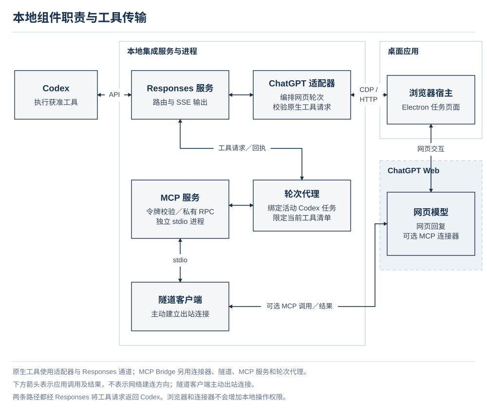
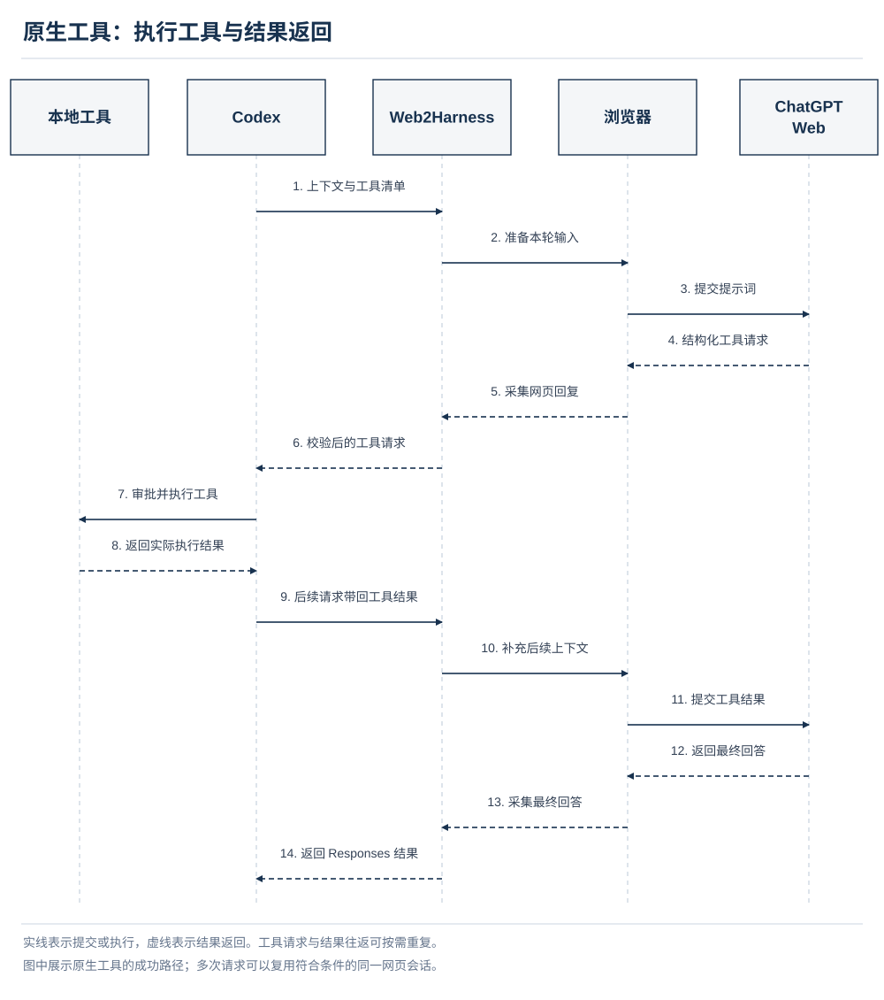
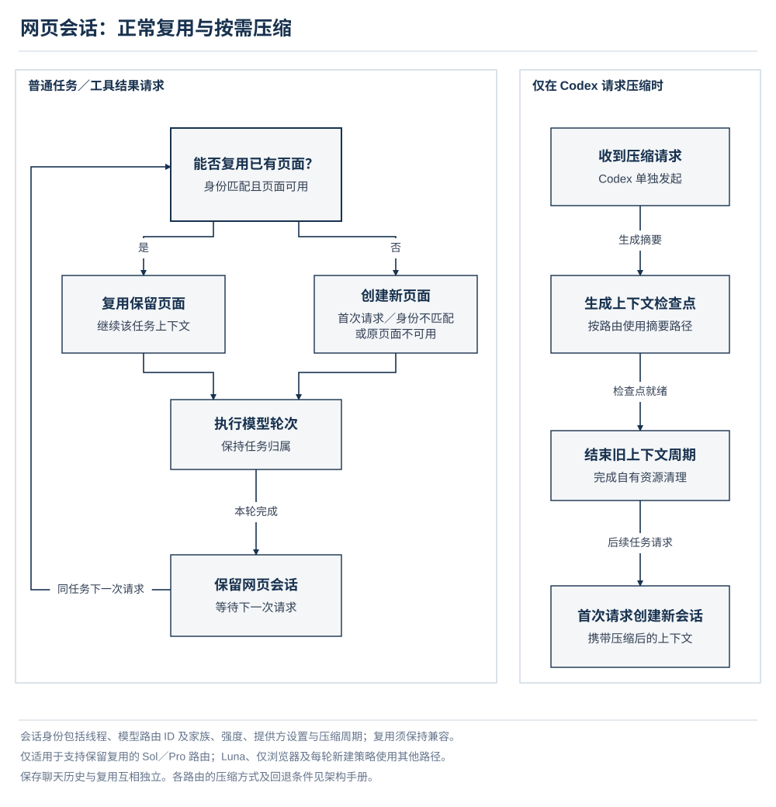
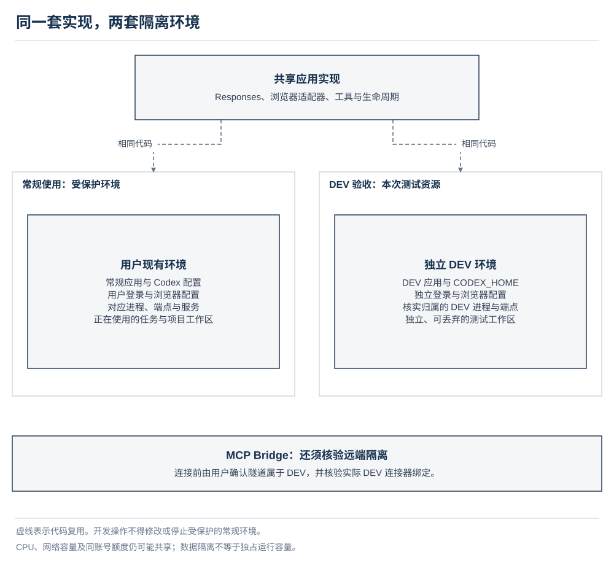

# 架构设计

[English](architecture.md) | [简体中文](architecture.zh-CN.md) · [项目文档](../README.zh-CN.md#documentation)

Web2Harness 将 Codex 的任务与工具环境接入已登录的 ChatGPT 浏览器会话。Codex 负责任务、工具执行、沙箱、审批和工作区变更；Web2Harness 负责模型路由、浏览器交互、协议转换及其生命周期。

本手册按系统组成和运行流程说明设计，安全约束随相应流程定义。桥接可以验证路由、工具清单与任务归属，但不会额外授予执行权限，也不能单靠自身使不可信模型输出变得安全。操作步骤见[使用手册](user-guide.zh-CN.md)，字段及预算见[配置与模型参考](reference.zh-CN.md)。

**本页内容**

- [系统上下文](#system-context)
- [组件与职责](#components)
- [执行模式与交互方式](#execution-modes)
- [请求与工具生命周期](#request-lifecycle)
- [对话状态与上下文压缩](#conversation-state-and-compaction)
- [安装、启动与停止](#installation-and-lifecycle)
- [安全边界与数据保护](#security-boundaries)
- [模型注册表与协议扩展](#model-registry)
- [失败处理契约](#failure-contracts)
- [开发环境隔离](#development-isolation)

## 系统上下文

*左侧边界包含工作区在内的全部本地组件。网页模型与原生模型使用不同的远端推理路径，本地工具始终由 Codex 执行。*

配置集成时保留 Codex 内置 `openai` 提供方，将其 Responses 流量指向回环地址上的守护进程。守护进程把官方原生模型请求转发到原有后端，并为浏览器适配器添加 `chatgpt-web/` 命名空间下的路由。经过身份验证的官方目录仍是原生模型的来源；Web2Harness 在其基础上追加条目，不安装另一个无关的静态目录。

ChatGPT Web 路由与原生/API 模型是不同的执行路径。名称相近不能证明它们具有相同的能力、推理选项、上下文容量、可用性或行为。Web 路由绑定经过观察验证的浏览器模型系列与账户能力。适配器不会悄悄以其他系列、推理强度或版本替代请求的模型。

本地桥接支持 Codex 的 HTTP Responses 与 SSE 传输。Responses WebSocket 预热收到 HTTP `426` 后，Codex 可协商切换为 HTTP/SSE，而不改变提供方或模型。经过身份验证的原生 Search 和 Image Gen 请求有独立转发路径。Voice 会话创建通过单独管理的配置项保留官方端点，不进入只处理 Responses 的桥接路径。

## 组件与职责

*上方展示网页轮次的编排路径；下方增加 MCP Bridge 的传输组件，工具请求仍经 Responses 服务返回 Codex 执行。*

| 组件 | 职责 | 主要实现 |
| --- | --- | --- |
| 桌面启动器 | 首次配置、设置、登录、诊断、启动门控与进程监督 | `launcher/electron/`、`launcher/src/` |
| 运行时监督器 | 启动可选隧道及守护进程、验证就绪状态、跟踪自有进程、安全排空与停止 | `launcher/electron/runtime/runtime-supervisor.cjs` |
| Responses 服务 | 路由模型和请求、提供健康检查与需认证的生命周期控制、统计活跃工作 | `src/server.ts`、`src/codex/native-passthrough.ts` |
| 协议桥接 | 把解析后的请求和适配器事件转换成原生 Responses 项、SSE、用量和终止错误 | `src/responses/` |
| 模型目录与注册表 | 定义 Web 路由身份、账户门控、支持的强度、上下文预算及目录追加规则 | `src/models/` |
| ChatGPT 适配器 | 编排逻辑轮次、重试、上下文准备、工具传输和压缩 | `src/adapters/chatgpt-web/adapter.ts` |
| 浏览器宿主与辅助进程 | 拥有 Electron 页面、分配精确页面租约、选择并验证界面状态、提交和观察轮次 | `launcher/electron/browser/`、`src/browser/` 及适配器的 `browser/` 目录 |
| 轮次代理与 MCP 服务 | 将连接器操作绑定到一个活跃 Codex 轮次及其公布的工具 | 适配器的 `tools/` 目录 |
| Codex 集成 | 应用和恢复受管理的配置项，维护集成日志、hook 和模型缓存 | `src/codex/` |
| 安装辅助程序 | 验证运行时清单、发布版本化运行时、管理 Windows 安装/卸载事务 | `launcher/electron/installation/`、`src/platform/windows/` |
| 配置迁移 | 将受支持的持久化结构转换为当前配置契约，不产生与特定运行环境相关的副作用 | `launcher/shared/config-migration.cjs` |

在 `src/responses/` 内，`stream.ts` 产生 SSE 事件，`json.ts` 构建非流式响应，`encoding.ts` 保存两条路径共用的编码规则。请求解析和状态管理保留在同一协议目录中，避免因传输形式不同而重复定义响应契约。

在 `src/adapters/chatgpt-web/` 内，`browser/` 处理页面控制和模型选择，`conversation/` 管理会话身份与压缩连续性，`prompt/` 准备任务上下文和附件，`tools/` 负责工具传输与活跃轮次绑定，由 `adapter.ts` 统一编排。这些目录划分的是共享适配器内部的代码职责，不是独立服务，也不是另设的 DEV 实现。

浏览器 worker 通过四个职责明确的模块编排轮次生命周期：`response-dom.ts` 读取响应结构与可见过程，`turn-observation.ts` 跟踪提交／完成证据及观察时限，`browser-diagnostics.ts` 收集有限且脱敏的诊断信息，`composer.ts` 处理输入框文字与附件准备。这些模块沿用同一选定页面和活跃轮次的归属约束。

Electron 的 `runtime/` 目录监督守护进程，`src/runtime/` 实现核心使用的服务和隧道操作。桌面的 `runtime/setup-checkpoint.cjs` 捕获、比较和恢复 setup 涉及的配置文件，外围事务与进程生命周期由监督器负责。`launcher/shared/` 不依赖 Electron：桌面包包含此目录，Bun 运行时打入同一个纯迁移实现。配置结构校验和持久化仍由各自的配置控制模块负责。

桌面包包含 Electron、匹配平台的 Bun 运行时、桥接服务、浏览器辅助进程和必需的运行资源。常规桌面路径使用内置浏览器，不依赖系统安装 Node、Bun 或 Chrome。可选的 macOS 通行密钥登录需要已安装的 Chrome，使用专用临时登录配置，随后将验证后的会话状态导入 Electron 并清理临时状态；模型轮次仍在 Electron 中运行。该传输边界见[安全模型](#local-and-network-surfaces)。MCP Bridge 还要求固定版本的官方隧道客户端，并根据其发布校验清单验证。

守护进程和 MCP 命令引用应用目录中持久保存的版本化运行时。AppImage 挂载点等临时包路径不得写入长期保存的集成命令。高级终端路径及其平台要求见[安装指南](user-guide.zh-CN.md)。

## 执行模式与交互方式

运行模式决定 Web 模型如何使用 Codex 工具。浏览器交互模式决定由谁操作 ChatGPT 页面。这是两项不同的设置。

| 运行模式 | 工具请求路径 | 工具执行 | 隧道与 MCP |
| --- | --- | --- | --- |
| 原生工具（默认） | 浏览器结构化回复 → 验证后的 Responses 工具调用 | Codex，遵循现有沙箱与审批策略 | 不启动、不附加 |
| MCP Bridge | ChatGPT 连接器 → 隧道 → MCP 服务 → 活跃轮次代理 → Codex 工具调用 | Codex，遵循现有沙箱与审批策略 | 必需 |
| 仅浏览器 | 仅浏览器回答；Codex 收到所选模型无法使用本地工具的提示 | 此 Web 路由不发起本地工具请求 | 不启动、不附加 |

### 上下文与传输协议分离

浏览器提交按以下顺序组织：一句话定义桥接职责、`codex_context_json` 内的原始结构化请求（或完整上下文附件）、独立的 `codex_bridge_protocol`。原始快照保留 instructions、角色、消息及内容块顺序、工具命名空间树、自定义格式、请求控制项、调用／结果 ID、错误字段及其他输入元数据。运行时索引单独维护，不用于替代原始上下文。传输凭证与本地路由元数据不进入原始上下文。

图片／文件字节使用经过验证的附件传输，并保留原始位置；桥接自身的推理／压缩封装提供可逆的解码视图。未知内容或无法读取的提供方加密内容会明确失败。桥接不会删除旧模型切换指令、替换类似句柄的文本、丢弃旧图片、裁剪压缩历史或自行总结；只有原生 Codex 压缩会替换规范历史。超过网页传输限制时拒绝发送；显式启用的 Context as File 可传输完整的受支持输入。

已验证的保留前缀使用 `transport_context.mode=append`，携带前缀长度与哈希；完整请求使用 `complete`。这些字段描述传输，不创建新的 Codex 角色。把多个原始角色编码到单条网页消息中，不能复制原生 API 的角色强制机制，也不能保证模型行为完全相同。执行、沙箱及审批仍由 Codex 负责。

MCP 工具调用现分别使用 `name`、`namespace` 与 `scope`。使用此协议前需刷新当前连接器缓存的工具定义；旧的普通 `wire_name` 调用会失败并提示刷新。已有的保留压缩控制仍使用 `wire_name`，不会静默替换连接器。

### 原生工具

适配器将当前工具定义放入编译后的上下文。浏览器回复结束后，它依据该 Codex 请求声明的工具解析结构化工具请求。有效请求转为原生函数或自由格式工具调用项。Codex 执行工具，并在下一次模型请求中返回结果。浏览器的最终回答转为 Codex 响应。

格式错误的工具块会产生明确的适配器错误。有限次数的纠正重试可从 Codex 规范历史重新构建上下文；无效浏览器决策不会被当作成功的工具执行。适配器不能通过提示词添加工具或授予权限。

原生工具模式的模型目录保留 Codex 原始 Code Mode 设置。请求解析保留自定义工具的格式与命名空间，JSON／SSE 输出恢复相同调用身份；顶层工具以原始名称、命名空间与类型标识，内部路由键不会成为模型可见的别名；同一身份出现冲突定义时，在分发前明确报错。`exec` 与 `wait` 在外层 Codex 进程执行，浏览器提示词将其与 ChatGPT 自身工具区分。内联文件数据复用图片的附件传输路径，并使用内容关联文件名、内容验证和显式 helper 能力协商；不会解析本地路径或远端提供方文件 ID。

### MCP Bridge

浏览器提示词携带一个仅对应当前外层 Codex 轮次的不透明能力令牌。每次连接器操作都必须提供该令牌。本地代理建立内部绑定、检查当前工具清单，再将请求转交给 Codex。结果通过 MCP 调用返回，因此多个工具回合可以持续发生在同一条 ChatGPT 回复内。

对于经 Codex 代码模式网关暴露的工具，连接器支持发现与精确名称调用，也原样转发网关的自由格式输入。顶层调用使用原始名称与命名空间；嵌套调用必须显式选择 exec 范围，并出现在运行时的 ALL_TOOLS 导出中。顶层可用不代表 exec 内部可用。这些机制暴露的是当前外层工具环境，不创建另一个执行器或规划器。所有可用 Web 推理强度使用同一套能力契约。

连接器身份属于公开 MCP 模式契约的一部分。自动与手动交互使用不同的连接器身份和隧道配置。不兼容的缓存连接器不能通过悄悄重命名或选择其他身份来复用。当前名称和配置要求见[配置参考](reference.zh-CN.md#runtime-settings)。

### 自动与 Zero Risk 交互

自动交互选择请求的浏览器模型与推理强度，在 Send 前验证它们，提交提示词和附件，并观察回复。三种运行模式均可使用自动交互。

Zero Risk 是仅在 MCP Bridge 中提供的手动交互。启动器打开自有页面，将编译后的提示词复制到剪贴板。用户粘贴内容，选择模型、推理强度和连接器，发送后确认 Sent。手动交互期间，启动器不检查或操作 ChatGPT DOM。开始与完成通过手动 MCP 契约报告，使用不透明请求标识；另一个仅在本地使用的随机值验证启动器确认操作。

手动交互改变浏览器控制边界。剪贴板中的提示词仍包含敏感任务材料，Zero Risk 的名称不构成安全保证；远端数据处理、本地工具权限和账户限制仍然适用。设置、截止时间、附件限制和重启要求见[使用指南](user-guide.zh-CN.md)。

MCP Bridge 的浏览器 Allow once 自动审批默认关闭。启用后只改变浏览器确认操作，不改变 Codex 的工具权限和审批策略。仅浏览器模式虽然不提供本地工具，任务上下文仍发送到 ChatGPT。

## 请求与工具生命周期

*从上到下阅读：网页模型请求工具，Codex 执行后将结果回传，模型继续推理。最终回答同样经过浏览器和 Web2Harness 返回。*

1. **接收并路由。** 守护进程跟踪请求、解析原生身份、展开支持的 `previous_response_id` 续接，并解析所选路由。原生请求走透传路径。Web 请求必须满足模型、推理强度、交互模式和账户契约。
2. **构建上下文。** 适配器编译指令、消息、工具定义与工具结果，依据路由运行预算及独立的输入框限制估算用量。图像字节通过稳定引用单独附加。可选的上下文文件和技能文件传输保留明确的读取契约，并受支持模式限制。
3. **取得所有权。** 浏览器工作进程取得精确的启动器页面租约。可复用对话只接收上一条助手回复之后的新后缀；新页面接收完整规范上下文。使用 MCP Bridge 时，轮次代理还会将轮次令牌绑定到当前 Codex 环境。
4. **提交并观察。** 自动交互验证浏览器选择和附件就绪状态。提交与回复绑定使用 ChatGPT 逻辑轮次标识，并纳入虚拟化历史的包装节点，不依赖可能变化的显示序号。身份缺失或歧义会明确失败。
5. **转发工具或完成。** 原生工具验证完整结构化回复；MCP Bridge 转发连接器操作并等待原生结果；仅浏览器返回文本。浏览器可见状态可映射为推理摘要，稳定文本可映射为进度说明。
6. **结算并释放。** 最终响应、错误或取消会结算逻辑轮次及活动租约。重连和已完成回合重放尽可能附着到已有工作，不能成为盲目重复提交已接受消息的理由。

SSE 心跳维持暂时没有输出的传输连接，另一个适配器进度看门狗检测模型路径停滞。心跳不能证明浏览器或工具取得了进展。HTTP 活动计数持续到响应体结算，浏览器会话计数还覆盖等待 Codex 工具的时间。

### MCP Bridge 能力生命周期

1. **确立原生环境。** 桥接从 Codex 原生信封提取工作目录、根目录、沙箱策略、线程和轮次。恢复任务或子代理省略必要上下文时，规范本地 rollout 必须证明精确身份与源轮次。请求元数据只能约束该权限，不能凭空创造。用户编写的环境文本及工具输出不能作为恢复权限的依据。
2. **绑定一个轮次。** 一个随机能力令牌随单个浏览器任务发送。每次连接器操作均携带它。MCP 服务取得内部绑定及调用活动租约，两者都不会作为模型可控的权限对象暴露。
3. **解析已公布工具。** 工具定义来自活跃请求。发现与精确名称调用仅限该清单，包括支持的代码模式工具。原始 exec 代码与等待参数原样转发，由 Codex 验证和执行。MCP 截止时间仍是独立的传输限制，超时会明确报错。Zero Risk 继续隐藏自身连接器命名空间与原始 exec，以避免递归手动交接。
4. **通过 Codex 执行。** 桥接返回原生工具调用；Codex 负责审批、沙箱、命令会话和结果。活动租约持续到处理器结算，包括不触发原生工具的清单查询操作。
5. **约束完成提交。** 工具分发前，浏览器确认当前回答投影。工具结果返回后，最终回答必须形成新的稳定投影。两阶段代理检查重新读取 DOM，仅当活动版本未变且没有活跃调用时提交完成。提交前发生的竞争操作使完成候选失效，提交后的操作被明确拒绝为已终止。
6. **退役。** 完成、取消、超时或所有者清理会结算轮次并撤销令牌后续用途。重试和重连必须保持精确轮次所有权，不能创建无关权限范围。

公开连接器身份也标识 MCP 接口契约。自动与 Zero Risk 使用不同身份和配置，不兼容的旧身份不能作为回退。所有受支持 Web 推理强度使用同一 MCP Bridge 契约。模型不可用、连接器不匹配和工具缺失均明确失败。

## 对话状态与上下文压缩

*左侧处理普通请求与符合条件的复用，右侧仅在 Codex 请求压缩时执行；完成检查点后进入新的上下文周期。*

必须区分三类不同状态：

| 状态 | 含义与生命周期 |
| --- | --- |
| Codex 历史 | 用于编译下一次请求的规范任务消息与工具结果 |
| 本地续接与轮次状态 | 支持重连及压缩的有界重放缓存、回合结果、检查点和所有权 |
| ChatGPT 对话 | 可在本地保留，也可能保存到远端 ChatGPT 历史的浏览器文档 |

**新配置默认开启“在 ChatGPT 中保存对话”。** 现有明确选择会保留。保存对话还是 Temporary Chat，与本地对话复用相互独立。保存的对话可能受到该账户 ChatGPT 记忆与自定义指令影响。改变保存偏好会使可复用的空闲页面失效，但绝不授权重新打开远端历史中的任意对话。

目前，保留复用适用于使用启动器宿主的合格原生工具与 MCP Bridge 路由，不包括 Luna 和显式启用每轮新对话的情况。身份由任务线程、模型、推理强度/系列、提供方配置及压缩周期组成。只有启动器能证明精确所有权时，才复用保留页面。发送增量前还会校验此前完整输入前缀及 instructions 的哈希。历史被修改时使用新浏览器聊天；缺少前缀证据时发送完整上下文。仅浏览器与 Luna 不使用该保留对话键；Luna 使用相同的原生 Codex 压缩路径，不再以私有滚动检查点替换历史。

每个任务页面都是独立的 Electron `WebContentsView`。页面通过同一个私有持久分区共享登录状态，但不共享对话文档或任务所有权。最多可同时活跃五个任务页签；额外并发轮次收到明确的容量错误。关闭运行中的页签会销毁其页面，并终止对应浏览器轮次。

可选的每轮新对话设置让每个自动模式原生轮次使用新对话和完整规范上下文。同一轮次中的工具回合与重连仍保留原所有者。Zero Risk 下此设置不生效。代价是更多上下文传输，收益是无需依赖保留页面继续下一轮。

自动保存聊天将远端对话 ID 绑定到自有页面；获取保留页面与发送前均拒绝不同 ID 或首页。启动器在描述符旁串行维护私有命名记录：任务身份哈希、任务短名、对话／压缩独立计数、创建时间、对话 ID、上下文键和命名回执。同一对话重复登记不增加编号，记录跨重启保留；损坏数据会保留，不静默重置计数。记录不授予重开远端历史的权限。改名在回复完成后通过精确对话的历史行菜单执行，名称更新失败不重发任务。手动 Zero Risk 保持不控制 DOM 的边界。命名与失败处理见[使用手册](user-guide.zh-CN.md#设置会话与上下文偏好)。

上下文压缩遵循明确的控制流程，不会将普通任务回答当作检查点：

- 使用 MCP Bridge 时，合格的保留对话生成绑定精确源身份的结构化检查点。其一次性压缩控制只接受该检查点，不能调用普通工具环境。
- 自动交互中该保留对话不可用，或每轮新对话策略要求时，专用只读摘要对话接收 Codex 规范历史。原生工具与仅浏览器也使用只读压缩路径。Luna 同样使用专门的原生压缩路径。
- Zero Risk 使用明确的手动 MCP 交接：活跃回复收到检查点指令，通过绑定的控制完成并退役。源缺失时需要手动检查点流程。
- 事务等待响应结算及辅助进程实际清理完成后，才关闭旧页面。返回 Codex 的原生替换历史或压缩项确立下一周期，其第一次浏览器轮次使用新对话。

续接缓存有大小和时间上限，并尽力保存私有磁盘快照。它可以支持守护进程重启后的重放，但不是持久任务数据库，也不是工作区权限的独立来源。上下文限制与输入框限制保持独立：大附件被接受，不能证明模型完整使用了它，也不能证明底层模型容量更大。

Temporary Chat 不会消除本地续接状态或日志，本地卸载也不会删除远端 ChatGPT 对话。页面共享登录分区，因而不是相互隔离的安全主体；五个页签的上限用于约束并发账户流量。

压缩后的续接必须把检查点及源指令匹配到原生线程、轮次、模型和推理强度。如果没有新的人类消息，环境声明还必须与规范 rollout 的目录、根目录和沙箱策略一致。摘要本身绝不授予文件系统访问权。本地续接快照是有界私有缓存，不是独立权限来源。

## 安装、启动与停止

*安装阶段发布经过验证的运行时。Windows 生产环境日常启动只验证安装状态，完整性失败时要求重新运行安装程序。*

安装、升级和修复根据确定性的路径/大小/SHA-256 清单验证包内容，复制到私有暂存位置，验证副本，再通过原子目录切换及回执提交发布。回执提交失败时恢复前一个运行时。回执记录的是完整性检查已完成，不是发布者签名。

Windows 打包生产安装由 NSIS 在报告成功之前部署运行时。独立辅助程序在替换应用前记录恢复状态，并拒绝在启动器运行时操作。它只能排空已验证的孤立运行时。失败会恢复先前安装，中断的事务在后续安装程序运行时恢复；恢复无法完成时保留恢复证据。

**Windows 生产环境启动绝不部署或修复运行时文件。** 它比较清单与回执身份，并检查四个执行入口文件。完整性失败会提示用户退出应用并重新运行安装程序。其他平台及隔离的打包 DEV 使用各自适用的运行时准备路径。完整诊断验证独立于轻量启动检查，不替换运行中任务使用的文件。

轻量启动检查不覆盖其余依赖文件的损坏；需要检查全部内容时使用完整诊断。安装回执也不能抵御具有相同用户写权限的进程。发布真实性、操作系统权限和运行时完整性是不同控制。

启动器首先显示本地启动画面。运行时就绪、浏览器初始化及初始快照可用后才挂载工作区。可计量阶段显示文件进度，其他阶段只显示活动状态，不编造整体百分比。准备错误会阻止进入主界面，并提供详细信息、安全诊断导出和重启操作。

启动器是桌面运行时监督者。选择 MCP Bridge 时，它先启动隧道并验证就绪，再启动 Responses 守护进程；其他模式直接启动守护进程。它校验带版本的健康状态和自有进程身份。自动启动项启动应用，由应用拥有这些子进程。意外退出的恢复有次数上限，持续崩溃会成为明确的启动器错误。

用户请求停止、重启、替换或卸载时，先经认证控制端点排空运行时，拒绝新工作。活跃 HTTP 请求和活跃浏览器/工具会话都归零后，监督器才停止隧道并请求守护进程刷写状态和退出。控制证据缺失、格式错误或仍有工作会阻止该生命周期操作。配置过程不会隐式重启已加载的守护进程。

断开 Codex 集成与移除应用是不同操作。集成日志恢复受管理配置项并保留无关配置。Windows 常规卸载断开集成、禁用应用自启动，除非用户选择完整清理，否则保留应用数据。活动运行时配置会被归档，避免重装自动重新连接。升级卸载跳过这类清理。

完整清理验证记录的所有权和每个允许的数据根目录。未知条目、链接、路径冲突或恢复冲突会阻止破坏性清理。独立卸载辅助程序拒绝运行中的启动器，不按进程名终止程序。Codex 身份验证、历史、项目、无关设置、远端 ChatGPT 历史及用户导出文件都不在清理范围内。平台操作见[安装指南](user-guide.zh-CN.md)，这些控制的信任限制见[安全模型](#security-boundaries)。

## 安全边界与数据保护

可信本地环境包括操作系统用户账户、Codex、已安装的 Web2Harness 运行时和 Electron。远端依赖包括所选 ChatGPT 账户/工作区；MCP Bridge 还依赖配置的精确连接器和 OpenAI 隧道服务。仓库文件、网站、附件、工具输出和模型文本即使出现在有效任务中，也是不可信内容。

| 资产 | 暴露范围与保护 |
| --- | --- |
| 工作区文件与命令权限 | 只能通过活跃 Codex 轮次提供的工具访问，并遵循 Codex 策略 |
| ChatGPT 登录状态 | 保存在私有持久 Electron 分区中，由该配置的任务页面共享；可选的 macOS 通行密钥登录会从专用临时 Chrome 配置导入经过验证的状态 |
| 任务上下文与附件 | 发送至所选 ChatGPT 对话，可能包含指令、源码内容、图像、工具模式、参数和结果 |
| 隧道运行密钥 | MCP Bridge 的连接凭据保存在私有文件并按路径引用，不写入命令参数或生成的配置文本 |
| 轮次能力与生命周期令牌 | 分别用于连接器轮次绑定和本地生命周期控制，不能互换 |
| 续接快照与诊断 | 可能包含任务数据的私有本地状态；原始文件不适合公开提交到问题报告 |

私有文件在支持的平台使用仅当前用户可访问的权限；Unix 权限检查与 Windows 账户访问控制采用不同机制。安全边界是用户的私有账户和文件系统，而不是假定某个 POSIX 模式值能让所有 Windows 文件免于其他软件访问。运行时完整性回执不会扩大这一边界，也不能防御操作系统用户账户失陷。

### 本地与网络接口

Responses 与健康检查监听器绑定到 `127.0.0.1`。公开请求接口没有独立的 Web2Harness bearer 密钥，因为集成保留 Codex 内置提供方及任务身份。因此，能访问该监听器的本地进程处于所假定的信任边界内。回环绑定避免它作为局域网服务暴露，但不能抵御已被攻陷的本地账户。

启动器浏览器描述文件标识配置类型、进程、私有分区、辅助程序、精确自有页面、回环 CDP 端点及需认证的控制端点。适配器在连接前检查该描述文件。CDP 可控制自有浏览器，必须保持私密；描述文件与控制令牌不得作为诊断资料公开。这些所有权检查防止意外连接错误配置，不会阻止恶意同用户进程使用其已有权限。

常规登录与获准的身份提供方弹窗保留在启动器自有页面中，共享该私有分区。配置过程同时要求服务端已认证会话及预期的 Temporary Chat 输入框；仅看到输入框不能证明身份验证成功。此常规路径不导入无关浏览器的会话。

可选的 macOS **使用通行密钥**流程以专用临时配置打开已安装的 Chrome。用户完成登录后，流程捕获允许的 ChatGPT/OpenAI Cookie 和 ChatGPT 本地存储，验证这些状态，再导入启动器自有的 Electron 分区。随后验证导入的会话并清理临时传输状态。导入或清理失败会明确报告，并触发对启动器部分导入会话的清理。此显式传输不复用用户日常 Chrome 配置；模型轮次仍在 Electron 中运行。

排空、恢复、取消、中断和停止等生命周期端点要求随机生成的应用专属 bearer 令牌。监督器在替换生命周期状态前证明 HTTP 与浏览器/工具工作均空闲。版本字符串或进程名称本身不足以授予停止进程的权限。

MCP Bridge 使用出站 HTTPS 隧道，以及由私有套接字或命名管道支撑的本地 stdio MCP 进程。它不需要公开应用监听器或入站防火墙规则。内置浏览器连接 ChatGPT、登录时允许的身份提供方和获准的附件资源。原生请求转发使用相应的、经过身份验证的官方服务路径。

### 主要风险与应对

| 风险 | 控制与剩余限制 |
| --- | --- |
| 提示词注入 | 把仓库内容、网站、附件和工具输出视为数据。注册表验证限制可用动作，但破坏性使用仍由 Codex 策略及用户审核控制。 |
| 浏览器会话被窃取 | 私有浏览器配置仅保留在本地。暴露后退出或撤销受影响账户会话；仅重装应用不会撤销远端会话。 |
| 隧道密钥泄露 | 使用文档规定的最小隧道权限、文件存储，并在暴露后轮换。不要把密钥放进问题报告或命令参数。 |
| 浏览器界面变化 | 精确验证模型、强度、提交和完成证据。失败时不替换模型，也不伪造成功。 |
| 本地进程被攻陷 | 回环接口与控制令牌减少意外访问，但不能隔离以可信系统用户身份运行的恶意代码。 |
| 诊断信息泄漏 | 使用 **Usage & Diagnostics → Logs → Export safe log**，分享前审核内容，原始状态与日志保持私密。 |
| 账户或服务限制 | 显示提供方限制；重试、切换模式或其他路由都不用于规避限制。 |

可选本地 Limits 台账记录已接受发送的回执、账户哈希、时间戳和模型系列，不记录提示词或身份验证令牌。它估算当前配置观察到的提交，不是远端额度权威来源，也不执行额度限制。Zero Risk 不进行自动账户检查或提交跟踪。

本设计不承诺抵御被攻陷的操作系统用户、Codex 程序、Electron 程序或远端账户，不绕过 ChatGPT 套餐、工作区、模型或用量限制，也不将浏览器自动化变为受支持的 API 契约。私密漏洞报告与泄露处置见[安全维护流程](release.zh-CN.md#security-maintenance)。

## 模型注册表与协议扩展

模型定义集中在 `src/models/chatgpt-web-model-registry.ts`，共享路由类型位于 `chatgpt-web-model-types.ts`。`chatgpt-web-models.ts` 门面解析账户资格与推理强度分组。`chatgpt-web-context.ts` 分别管理路由预算、压缩阈值和单消息传输限制。`model-catalog.ts` 将这些定义与经过身份验证的原生目录组合。

新增支持需要稳定路由身份、经过观察的浏览器系列/版本、支持及默认推理强度、账户门控、选择器证据和明确预算策略。预算不兼容的强度必须有独立路由；目录生成必须拒绝未处理的不一致，不能缩减或悄悄统一契约。隐藏兼容 slug 保持原有绑定，使保存的任务仍能解析。

原生目录条目、API 模型名称和浏览器 Latest 标签都不能作为新增 Web 路由的支持证据。需要验证 Send 前选择、旧任务路由、账户门控、原生目录保留，以及受影响的真实 DEV 工具往返。验收参见[开发指南](development.zh-CN.md)和[发布验证](release.zh-CN.md)。文档和视觉约定统一见开发指南。

子代理兼容性同样需要明确选择。Compatibility V1 为原生和 Web 委派应用协同的目录/配置契约。Native 模式保留官方协议接口，并向路由条目提供所选接口。Web 发起的 V2 协作消息使用协议的明文标记；真正加密的原生到 Web 载荷在打开浏览器之前拒绝。现有任务保留启动时固定的协议，因此切换后必须重启 Codex 并新建任务。具体受管理设置见[配置参考](reference.zh-CN.md#runtime-settings)。

## 失败处理契约

| 条件 | 必需行为 |
| --- | --- |
| 不支持的路由、强度、账户能力或浏览器选择器 | 明确报错；不静默替换模型或强度 |
| 提交或回复身份有歧义 | 停止轮次；不为修复 DOM 重发已接受的消息 |
| 无效结构化工具输出 | 明确失败，只使用有界纠正重试策略 |
| 工具仍在运行或有并发 MCP Bridge 活动 | 在因果完成证据有效前阻止完成 |
| 浏览器页签关闭、任务取消或能力退役 | 结算自有工作并撤销其后续工具调用能力 |
| 用量限制 | 显示限制；不通过更换账户、模式或模型规避 |
| 运行时忙碌或进程所有权不确定 | 阻止替换/停止，不操作无关进程 |

## 开发环境隔离

*虚线表示两套环境使用相同代码；配置、登录、端点和进程归属分别管理。DEV 标签不能证明远端连接器隔离。*

开发和验收必须使用[开发指南](development.zh-CN.md)中的隔离 DEV 配置及测试工作区。生产与 DEV 的配置、凭据、`CODEX_HOME`、浏览器分区、描述文件、端点、进程所有权和诊断必须分离。使用独立登录和文件凭据。测试 MCP Bridge 前，取得用户对隧道属于 DEV 的明确确认，并验证实际远端连接器绑定。

不得通过修改生产路由、复制生产身份验证、削弱机器沙箱或停止无关进程来测试。真实验收前后比较生产配置/身份验证哈希及相关进程身份，原始证据保存在私有位置。无法遵守这些边界的安装器、更新器和服务检查应放在一次性虚拟机或专用测试系统中。自动化工作遵守 [AGENTS](../AGENTS.zh-CN.md)，具体隔离流程见[开发手册](development.zh-CN.md#standard-isolated-test-procedure)。

DEV 使用共享服务、适配器、模型目录、浏览器路径和 Codex 工具实现。真实开发测试从 `bun run dev:launcher` 开始，再通过 `bun run dev:codex` 或 `bun run dev:chat` 运行任务。浏览器模拟器、进程成功退出或模型的成功声明都不能替代命令执行和文件变更证据。

[返回项目文档](../README.zh-CN.md#documentation) · [开发指南](development.zh-CN.md) · [发布手册](release.zh-CN.md) · [故障排查](troubleshooting.zh-CN.md)
