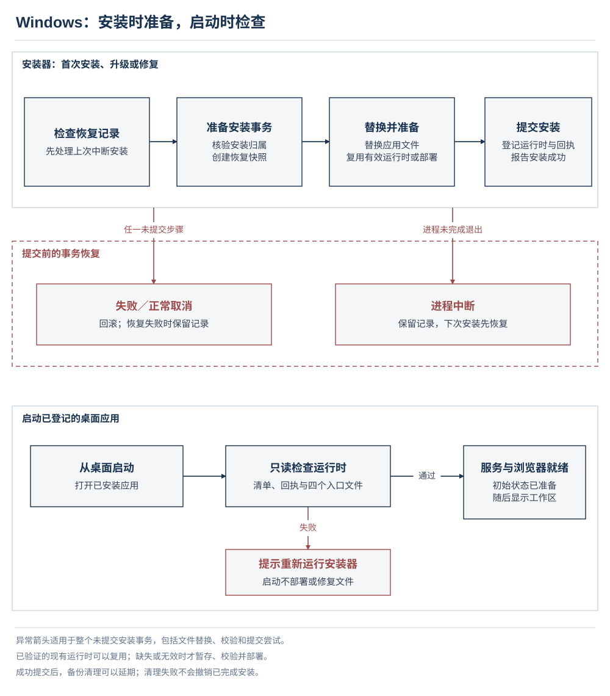

# 发布手册

[English](release.md) | [简体中文](release.zh-CN.md) · [文档导航](../README.zh-CN.md#documentation)

本手册说明候选版本的准备、构建、验收、发布和恢复，以及安全问题的报告与处置。每次发布均须建立当前候选版本的证据：可复现的原生包、运行时和安装验证、真实账户验收，以及准确的发布元数据。CI、夹具和历史版本的通过记录不能替代本次验收。本页列出执行要求，不表示这些检查已经通过；日常源码开发见[开发手册](development.zh-CN.md)。

**本页内容**

- [验证环境与证据](#validation-evidence)
- [版本与源码准备](#source-preparation)
- [原生目标矩阵](#native-target-matrix)
- [运行时与打包检查](#runtime-packaging)
- [启动与完整性检查](#startup-integrity)
- [真实账户与工具验收](#authenticated-runtime)
- [Windows 安装、恢复与卸载](#windows-installation)
- [各平台账户验收](#platform-acceptance)
- [签名、许可与校验和](#signing-checksums)
- [发布与更新可见性](#publication)
- [撤回与回滚](#rollback)
- [安全维护与漏洞报告](#security-maintenance)

<a id="validation-evidence"></a>

## 验证环境与证据

开发和登录态运行时检查遵守[标准隔离测试流程](development.zh-CN.md#standard-isolated-test-procedure)。全新安装、升级、修复、卸载、更新器和系统服务验收使用一次性虚拟机或专用测试系统，并配置独立 Codex 和浏览器状态。不得向用户正常 Codex 写入测试路由、修改其桌面安装或使用其凭据。

| 证据类型 | 能证明什么 | 仍需独立验证什么 |
| --- | --- | --- |
| 核心与启动器夹具 | 受控依赖下的确定性行为。 | 真实浏览器/账户行为和系统安装事务。 |
| 迁移运行时冒烟 | 迁移后内嵌运行时、必要资源、基础 HTTP 和生命周期约定。 | 登录态工具执行和安装恢复。 |
| 原生包冒烟 | 包在测试系统启动并生成预期就绪标记。 | 交互登录、真实 Codex 任务及升级/修复/卸载覆盖。 |
| 登录态 DEV 验收 | 隔离的共享运行时中真实浏览器、模型和工具行为。 | 安装包、更新器、服务和系统集成门禁。 |
| 专用测试系统验收 | 已测场景下真实安装器和已安装应用行为。 | 未测试的平台、版本、账户计划或架构。 |

每个候选版本记录版本、源码提交/tag、工件 SHA-256、操作系统版本/架构、全新安装或升级路径、旧安装版本、Codex 版本、ChatGPT 计划、启用模式和逐项结果。通过、失败、未执行分别列出。包含脱敏失败日志和复现步骤；不得公开 Cookie、隧道 ID、API key、bearer token、凭据或提示词内容。原始证据和生产基线保存在被忽略的本地存储中。

必需门禁失败或未执行均阻止稳定发布。公开预览版必须列明未完成/失败门禁、用户可见限制和恢复路径。依赖 audit 失败与功能检查独立保留。历史结果不能替代当前候选版本的证据。

<a id="source-preparation"></a>

## 版本与源码准备

1. 确定版本，同步根目录/启动器清单、`src/version.ts`、安装脚本默认值及 `scripts/check-version.ts` 检查的其他字段。发布 tag 必须等于 `v` 加根包版本。
2. 使用固定的 Bun `1.4.0` 和两份冻结锁文件，记录源码 revision，并将候选构建与无关本地修改分开。
3. 执行 `bun run verify` 并检查每个阶段。它遇到首个失败即停止；后续阶段在单独执行前仍算未执行。
4. 核对启动器元数据中的目标仓库身份。发布工作流把当前仓库传给打包流程。安装脚本要求显式 `WEB2HARNESS_REPOSITORY`，缺失或无效时在安装前拒绝继续。
5. 重建前保留之前的候选工件。打包会替换 `launcher/artifacts` 中匹配的生成文件；应使用自有构建工作区，不把该目录作为证据归档。

```bash
bun install --frozen-lockfile
bun install --cwd launcher --frozen-lockfile
bun run check-version
bun run verify
bun run build
bun run launcher:build
bun run app:package
```

`build` 输出 `dist/runtime`。`app:package` 重建启动器和内嵌运行时、准备平台 helper，最终将分发包写入 `launcher/artifacts`。它不发布工件；封装脚本向 electron-builder 传入 `--publish never`。包清单中名义上的 `release` 输出目录被封装脚本的临时构建目录覆盖。

<a id="native-target-matrix"></a>

## 原生目标矩阵

[发布工作流](../.github/workflows/release.yml) 在匹配的原生 runner 上构建以下目标。由于启动器包含原生 Bun，跨操作系统打包会被拒绝。

| 原生目标 | 工作流 runner | 运行时归档 | 桌面包后缀 |
| --- | --- | --- | --- |
| macOS arm64 | `macos-15` | `web2harness-darwin-arm64.tar.gz` | `-mac-arm64.dmg`、`-mac-arm64.zip` |
| macOS x64 | `macos-15-intel` | `web2harness-darwin-amd64.tar.gz` | `-mac-x64.dmg`、`-mac-x64.zip` |
| Linux x64 | `ubuntu-latest` | `web2harness-linux-amd64.tar.gz` | `-linux-x64.AppImage` |
| Linux arm64 | `ubuntu-24.04-arm` | `web2harness-linux-arm64.tar.gz` | `-linux-arm64.AppImage` |
| Windows x64 | `windows-latest` | `web2harness-windows-amd64.zip` | `-win-x64.exe` |

桌面文件名以 `web2harness-${version}` 开头。x64 的运行时归档使用 `amd64`，桌面包使用 `x64`，不可混用。macOS 配置的最低版本为 13.0。存在构建目标不代表所有支持系统版本均已通过交互验收。

Windows CI 使用 `scripts/prepare-windows-baseline-bun.ps1` 准备不依赖 AVX2 的 Bun。所选内嵌程序必须报告固定版本；若使用 `WEB2HARNESS_EMBEDDED_BUN`，其值必须是绝对路径。不得通过更新全局 Bun 来改变候选包的内嵌运行时。

Linux 构建按工作流准备兼容 libnotify 和自有 AppImage 工具集。arm64 要求绝对路径形式的 `APPIMAGE_TOOLS_PATH` 及兼容 `libnotify.so.4`。保留 AppImage 符号/ABI 检查，包括 x64 的当前 Arch 容器检查。包冒烟使用 `xvfb-run`。这些依赖应在构建主机或专用测试系统中准备，不得为验收修改用户正在工作的机器。

<a id="runtime-packaging"></a>

## 运行时与打包检查

### 可迁移运行时

`scripts/build-runtime-bundle.ts` 构建 CLI 和浏览器 helper，安装生产依赖，嵌入 Bun，并写入包含文件哈希和包身份的 manifest。验证迁移后的包，不能只验证源码树：

```bash
bun run smoke
```

冒烟检查版本、manifest、不含临时构建路径、tokenizer/Playwright/MCP/Markdown 资源、helper 加载、HTTP 回退与失败行为、认证生命周期控制和正常退出。精简后的包仍须保留可执行资源与许可文件。helper 能加载不代表真实安装或工具任务能运行。

### Windows 内嵌 Bun 回归

Windows 的 `app:package` 包含启动器 `build:runtime`，后者调用 `scripts/build-windows-helpers.ts`。该脚本构建独立安装/卸载 helper，然后使用包内实际 Bun 执行两套共享安装测试：

```powershell
& .\launcher\build\runtime\runtime\bun.exe test ./launcher/tests/installation/windows-install.test.cjs ./launcher/tests/installation/runtime-install.test.cjs
```

此门禁是强制步骤，失败即停止打包。`bun run verify` 在 Node 下执行启动器测试，不能替代内嵌 Bun 门禁。覆盖全新部署、同版本替换/修复、复制和回执失败、重复取消，以及 setup 进程未回滚退出后的重试。不得用仅加载 helper 的探针替代。夹具仍不能满足真实 NSIS 验收。

### 原生包冒烟

在对应测试系统上运行候选包：

```bash
bun run app:smoke
```

Windows 上该命令会用 `/S /currentuser` 真实执行 NSIS 安装器并查询安装注册信息，因此只能在一次性虚拟机或专用测试系统中执行。隔离运行时环境变量不能隔离安装事务。包就绪标记必须包含预期版本、平台和已验证的安装运行时。

安装和应用启动必须使用同一套临时数据目录。失败时，脚本先通过共享日志脱敏逻辑，将命令结果和应用日志导出至 `output/package-smoke/`，再删除临时工作区；不收集浏览器配置、凭据或环境变量转储。若导出失败，则保留工作区并输出路径。CI 和发布构建会上传这些诊断报告，保留七天；重试前应查看致命错误日志和失败报告。冒烟成功后直接清理临时工作区，不发布诊断文件。

Shell 入口脚本必须以 Git 模式 `100755` 提交。Linux 工作流在检出代码后立即检查可执行权限。在 Windows 上重新初始化仓库时，需要显式恢复这些执行位；本地 Windows 检查无法验证 POSIX 执行权限。

<a id="startup-integrity"></a>

## 启动与完整性检查

- 分别测量快捷方式到窗口可见、运行时就绪和 ChatGPT 就绪时间。准备期间只显示本地启动页，工作区/引导页不得提前闪现。初始化与快照完成后在同一窗口切换，不增加人为最短等待；依赖运行时的 IPC 必须拒绝过早调用。
- 检查保存/系统语言、阶段内进度与文件数量、不可测量阶段的活动提示和减弱动态效果。正常热启动不得显示完整安装步骤列表。
- 检查日志中的阶段耗时和修复原因。失败必须停止进度，提供展开详情、安全日志导出和重启。验证日志导出取消/失败；准备期间退出必须等待安装事务完成。
- 全新部署只各哈希一次源目录和临时副本，原子提交，并在回执失败时回滚。访问/磁盘失败必须明确报告；损坏源不得进入反复全树哈希重试。验证延迟文件就绪且不重复扫描。
- 热启动比较包/安装 manifest 和回执身份，仅检查 Bun、CLI、浏览器 helper、命令启动器四个入口，不遍历 `node_modules`。覆盖缺少回执、入口损坏、同版本 bundle 身份改变。
- 安装、升级、修复和显式诊断必须完整校验包。回执不是密码学签名，也不能防范同一用户身份运行的其他进程。轻量启动检查不覆盖非入口依赖损坏。
- 完整诊断失败应标记待修复。Windows 生产启动要求重跑安装器，不得自行部署/修复可执行文件；其他平台保留下次启动修复流程。任务运行期间不得替换可执行文件。
- 移除 Codex 集成应保留已安装版本/回执，让下次启动走热路径，同时仍移除配置和集成凭据。

<a id="authenticated-runtime"></a>

## 真实账户与工具验收

共享运行时验收使用隔离 DEV；涉及安装应用的流程按要求在专用测试系统重复。凭据必须独立获得。模型能力以账户实际可见能力为依据，不能从标签或原生 Codex 模型条目推断。

### 原生工具

1. 完成真实 Codex 读取、原生补丁、命令断言和最终答复，保留结果文件和工具事件证据。
2. 取消活动任务，确认终态取消且活动任务为零，再不重启 daemon 运行新任务；已取消任务不得复活。
3. 只对已核实的一个 DEV 页面注入有界 DOM 观察超时，确认重新绑定同一自有页面并继续，且工具不重复执行。
4. 仅短暂中断自有 DEV 目标/传输，要求正确续接或明确终态失败，记录实际结果、时长和范围。
5. 验证自动压缩、摘要安装和同一 daemon 中继续使用原生工具。若仅降低子进程阈值，必须记录；这不代表默认窗口容量或压力验收通过。
6. 前后比较生产配置/认证哈希和进程身份。测试凭据缺失或过期应记为未执行/失败，不是产品通过。

### 对话与模型行为

- 在 Reuse conversation 与 Save to history 下，证明至少两次真实工具结果往返及后续用户消息使用同一 ChatGPT conversation ID。重放相同 Responses 请求不得重复提交浏览器消息。另测 New each turn；历史保存和对话复用相互独立。
- 新配置或缺失历史偏好时，UI 与核心均默认 Save to history。已有显式 true/false 在 setup 与升级后保留。账户探测保持临时页面，不改变复用行为。
- 在具备 Pro 的账户上验证受支持的 Sol/Pro 条目：`GPT-5.6 Sol (Web)`、`GPT-5.6 Sol Pro (Web)`、`GPT-6 Pro (Web)`。普通 Sol 默认 High；Low/Medium/High/账户支持的 Extra High 必须选择正确网页档位，Pro 固定 Max。
- 账户预算不同时保持 Instant 独立：Thinking 的上下文/压缩预算为 90k/80k，Instant 为 41k/32k。隐藏的 Instant ID 仍可继续旧任务。普通 Sol 的 Max/Ultra 必须拒绝，不能静默切模型。保留原生模型条目、档位和预算。
- 启动器与 Codex 目录必须一致展示支持档位和默认值。GPT-6 Pro 必须识别为 Astra 家族；“Latest”标签、滑块位置或原生 Codex 模型均不能单独证明网页模型家族支持。参见[模型参考](reference.zh-CN.md)。

### MCP Bridge 与手动交互

任何 MCP Bridge 测试前先核实 [DEV 隧道及连接器绑定](development.zh-CN.md#mcp-bridge-isolation)。原生工具证据不能证明 MCP Bridge 通过。

- 配置已验证的独立连接器，运行 **Verify runtime**，完成一次真实本地工具任务；账户可用时再测 Pro。
- 全新 setup 应提供两种交互模式并默认 With Automation。切到 Zero Risk 后重启 Codex，确认只有一个通用 Web 模型、保留对话只收到下一条提示词，并在压缩后的续接进入新手动对话前通过 MCP 完成压缩。
- 检查复制的手动提示词：可包含当前 `request_id`，不得包含 surface nonce、capability token 或提示词级生命周期命令。切回 Automatic 后恢复账户可见目录。
- 关闭活动启动器标签以取消，再单独使用启动器取消操作。取消后不得重建标签或让运行时持续忙碌。
- 活动任务期间通过明确取消流程退出，重开后验证已保存浏览器会话与 Codex 路由仍有效。
- 验证 Responses 使用本地 bridge 时 Codex Voice 仍可创建 WebRTC 通话。断开必须精确还原两项旧路由赋值；重连复用已有私有 MCP 凭据。

<a id="windows-installation"></a>

## Windows 安装、恢复与卸载



在专用 Windows 测试系统执行下述场景，覆盖交互式和静默 setup。静态编译、夹具通过或就绪标记均不能代替这些场景。

| 场景 | 必须满足的结果 |
| --- | --- |
| 全新安装、升级、同版本修复 | 安装器报告成功前完成运行时部署。首次启动只检查就绪、初始化浏览器并进入工作区；启动器不得全树哈希或复制。 |
| 回执有效但非入口依赖损坏 | 重新运行 setup，通过完整包校验发现并修复。 |
| 复制/部署失败、文件忙、空间不足、setup 中断 | 恢复旧程序文件、运行时/回执、注册信息和快捷方式。恢复失败保留证据，下次安装器运行可继续恢复。 |
| 在每个可取消向导阶段取消，再重试 | 先恢复待完成安装；提交成功的安装不因关闭完成页而丢失。 |
| 从上一公开版本升级 | 保留启动器/浏览器状态、Codex 配置及 MCP 配置；正常生产 Codex 数据不变。 |
| 普通卸载 | 清理数据复选框初始未选中且不记忆。保留设置、登录和运行时，只断开 Web2Harness 并移除自启。重装需明确执行集成配置，不得静默重连归档配置。 |
| 明确选择清理数据的卸载 | 移除自有核心/桌面数据、NSIS 缓存与安装记录。保留 Codex 认证/历史、无关配置及原生模型缓存条目/元数据。 |
| 升级/覆盖和静默升级 | 保留数据与集成，不出现清理页。拒绝通用 `--delete-app-data`；普通静默卸载始终保留数据。 |
| 卸载准备失败或程序文件忙 | 删除前停止；恢复忙碌程序文件并保留卸载注册以便重试。 |

覆盖活动启动器/任务、孤立运行时 drain、路由/hook 被改动、归属缺失/损坏、自定义根目录、未知文件、junction、权限/锁定和部分清理重试。不得终止未验证归属的进程。卸载 helper 必须从私有临时目录运行，即使已安装运行时不可用；退出后仍可访问正常/失败启动路径。

<a id="platform-acceptance"></a>

## 各平台账户验收

Windows 11 x64 使用专用测试系统中的候选安装包与真实账户，验证内嵌 Bun 启动、独立嵌入浏览器登录、Temporary Chat 输入框、模型路由安装和目录刷新且原生模型不丢失、仅浏览器流式任务、上述运行时门禁，以及从上一公开版本升级。

macOS 在最低支持系统或最接近的持续维护测试机器上，重复登录、目录、仅浏览器、MCP Bridge、压缩、手动交互、取消、重启以及路由/Voice 恢复。记录覆盖缺口；打包和签名校验仍是独立门禁。

Linux 必须通过原生包冒烟。声明交互式 Linux 支持前，在受支持桌面会话中执行登录、目录、仅浏览器、MCP Bridge、压缩和手动交互，记录架构、系统、显示服务器和包格式。没有证据时不得把 x64 交互结果扩展到 arm64。

<a id="signing-checksums"></a>

## 签名、许可与校验和

macOS 打包通过 `codesign --verify --deep --strict` 验证解压后的 `.app` 和内嵌运行时。未提供 `CSC_LINK` 或 `CSC_NAME` 时，封装脚本使用 ad-hoc macOS 签名并禁用身份自动发现。完整性检查通过不代表 Developer ID 签名或 notarization。记录实际分发包的签名身份/公证状态，没有证据时不得声称具备证书签名；Windows 签名同样遵守此要求。

包含根许可文件、必要 `LICENSES` 文件和生成的 `THIRD_PARTY_NOTICES.txt`。运行时准备会复制整个许可目录，分发检查必须确认打包后仍存在。修改产品命名或文档时保持现有许可正文和归属文件不变。

发布工作流汇集各平台工件，添加许可/声明和安装脚本，拒绝重复文件名，并生成包含 SHA-256 的 `checksums.txt`。发布后它根据 GitHub 工件摘要重建 manifest、上传并校验已发布工件及 manifest 的摘要。检查最终清单，确认每个预期下载文件均被覆盖。

安装器与更新器要求预期平台工件和校验条目，并拒绝不匹配。校验和只证明字节与已发布 manifest 一致，不能代替平台签名或发布验收。在真实工件和 manifest 可用前，不得发布猜测的下载 URL 或启用安装指引。

<a id="publication"></a>

## 发布与更新可见性

tag 工作流可在构建完成后自动发布；绿色工作流不会自动强制检查人工账户/安装器证据。稳定发布前必须先完成要求的证据。

- draft 尚未公开，pre-release 是公开预览。更新器和默认启动器安装脚本查询 `/releases/latest`，预览版被排除。源码和 DEV 运行禁用更新。
- `v6.0.0-rc.1` 等带后缀 tag 自动标记 pre-release；重跑保留已有发布的 pre-release 状态。
- 若使用最终版本 tag 测试且不暴露给稳定更新器，应在推送 tag 前建立 draft 并勾选 **Set as a pre-release**。不得先短暂稳定发布再改标记。
- 晋级复用已验证的原二进制：取消 **Set as a pre-release** 并选择 **Set as latest release**，或发布更高的已验证稳定版本。二进制改变必须使用新版本。
- 启动器启动时检查更新，并要求版本更高、平台工件匹配且存在校验 manifest。已运行启动器不会持续轮询发布状态。

发布说明应包含版本/tag、支持和已测目标、签名状态、重要行为/配置变化、验证缺口、已知问题和恢复步骤。只为该发布确实存在的文件提供安装链接。配置了仓库元数据不代表已有发布。

<a id="rollback"></a>

## 撤回与回滚

候选版本有问题时停止晋级，并更正公开状态和说明。撤回发布或改成预览版不会回滚已安装客户端。更新器只提供更高版本，不得声称自动降级。

保留问题二进制、校验和、源码 revision 和脱敏失败证据。在专用测试系统复现恢复流程，确认安装事务回滚能够恢复程序文件、运行时/回执、注册信息、快捷方式和路由归属，且不覆盖无关 Codex 数据。不得替换活动可执行文件，也不得用测试备份还原用户生产配置。

对已分发版本优先发布新的修复版本。确需手动重装已知良好版本时，先验证准确恢复路径和状态兼容性，再编写指引。公布具体恢复步骤和剩余限制；不得替换已发布版本下的工件来掩盖失败候选版本。

<a id="security-maintenance"></a>

## 安全维护与漏洞报告

本节规定私密报告、敏感证据、泄露处置与依赖审查要求。运行时信任边界和技术限制统一见[架构手册](architecture.zh-CN.md#security-boundaries)。

<a id="vulnerability-reporting"></a>

### 报告漏洞

先在[仓库安全页面](https://github.com/cmyk-labs/web2harness/security)查看是否提供私密报告渠道。若未提供，在不公开利用细节或敏感数据的前提下，向[维护者](https://github.com/cmyk-labs)索取私密联系方式。本手册不表示该渠道当前已经启用。普通功能缺陷按照[贡献流程](development.zh-CN.md#contributing)处理。

有效的私密报告应包含：

- 应用版本或提交号、操作系统和受影响的集成模式。
- 触发前提和最小复现步骤。
- 预期行为及实际越界行为。
- 潜在影响，包括暴露的数据或操作范围。
- 已脱敏的支撑证据，以及已经采取的临时措施。

通过私密渠道协商披露安排。安排披露期间，不公开凭据、有效访问令牌、用户数据，或会暴露活动账户的利用样例。附件按以下要求处理：

| 信息 | 处理要求 |
| --- | --- |
| 浏览器配置、Cookie 和存储 | 保持私密，不上传、同步或作为报告附件。 |
| API 密钥、隧道凭据和控制令牌 | 不放入问题描述、命令示例、截图或版本控制。 |
| 任务上下文、提示词、工具结果和附件 | 分享前检查其中的个人、账户和项目内容。 |
| 配置、描述文件和本地备份 | 按敏感资料处理，其中可能包含凭据和私有路径。 |
| 诊断导出 | 使用「导出安全日志」，发送前再次检查，不以原始日志替代。 |

诊断资料的收集步骤见[支持报告流程](troubleshooting.zh-CN.md#support-report)。

<a id="suspected-exposure"></a>

### 疑似泄露处置

1. 停止受影响任务，通过文档规定的控制入口断开相关集成。
2. 使用对应账户的控制功能撤销或更新已暴露的浏览器会话和凭据。
3. 将脱敏证据保存在私有存储中，不把秘密内容复制到公开报告。
4. 确认受影响版本和配置，按照上文私密报告流程提交。

没有泄露证据的功能恢复按照[故障排查](troubleshooting.zh-CN.md)执行，不将删除数据目录作为通用诊断步骤。

<a id="dependency-security"></a>

### 依赖安全维护

依赖检查覆盖核心与桌面应用的两份包清单和锁文件。移除安全相关版本覆盖前，须评估当前审计结果及受影响集成测试。具体版本以包清单和锁文件为准，不在政策说明中重复维护版本表。审计命令见[开发检查](development.zh-CN.md#automated-checks)。

安全修复遵守[候选版本证据要求](#validation-evidence)，包含工具边界、运行时完整性和适用平台验收。此前审计或测试成功不代表当前安全状态。[签名与校验和要求](#signing-checksums)独立于依赖审计。
